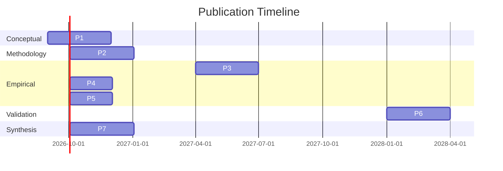

# Publication Roadmap

**Artifact:** Publication Roadmap  
**Version:** 0.1.0  
**Status:** Foundation complete — timelines are estimates subject to evidence availability  
**Canonical:** Yes — guides publication planning and resource allocation  

---

## Publication Strategy

The CRG-ANL Research Program follows a strategic publication sequence designed to:
1. Establish the theoretical foundation first (constructs, taxonomy, methodology)
2. Follow with empirical evidence (pilot studies, longitudinal findings)
3. Culminate in benchmark instruments and community resources

All publications will be open access where possible, with preprints posted to arXiv or PsyArXiv before peer review.

---

## Planned Publications

### Publication 1: Construct Definitions and Benchmark Taxonomy

| Attribute | Value |
|-----------|-------|
| **Title** | Constitutional Runtime Governance for AI-Native Learning: A Construct Ontology and Benchmark Taxonomy |
| **Type** | Conceptual / Framework Paper |
| **Venue** | Computers & Education (AI) or Educational Technology Research & Development |
| **Target Date** | 2026 Q4 |
| **Dependencies** | Construct definitions v1.0, benchmark taxonomy v1.0 |
| **Content** | Full construct ontology (11 constructs), benchmark taxonomy (5 primary dimensions, 22 sub-dimensions), theoretical grounding, relationships, severity framework |
| **Novelty** | First comprehensive framework for evaluating governance in AI-native educational systems; first to define Cognitive Safety, Instructional Integrity, and Transition Integrity as measurable constructs in this context |
| **Status** | Drafting in progress |

### Publication 2: Researcher-as-Subject Methodology

| Attribute | Value |
|-----------|-------|
| **Title** | The Researcher-as-Subject Methodology for Evaluating AI-Native Educational Systems: Protocol, Validity, and Bias Mitigation |
| **Type** | Methodology Paper |
| **Venue** | Journal of Learning Analytics or International Journal of AI in Education |
| **Target Date** | 2027 Q1 |
| **Dependencies** | Pilot 001 protocol execution, validity analysis, bias audit |
| **Content** | Detailed methodology, observation schema, protocol fidelity assessment, validity evidence, bias mitigation effectiveness, limitations |
| **Novelty** | First rigorous methodological framework for N-of-1 research in AI education; first to systematically address validity threats in researcher-as-subject design |
| **Status** | Protocol complete; awaiting pilot data |

### Publication 3: Quantic Pilot Study — Cognitive Safety and Instructional Integrity

| Attribute | Value |
|-----------|-------|
| **Title** | Cognitive Safety and Instructional Integrity in a Mobile-First AI Tutoring System: A Longitudinal Researcher-as-Subject Study |
| **Type** | Empirical Research Paper |
| **Venue** | Computers & Education or Learning and Instruction |
| **Target Date** | 2027 Q2 |
| **Dependencies** | Pilot 001 complete (all core courses), benchmark application, statistical analysis |
| **Content** | Longitudinal findings on Cognitive Safety and Instructional Integrity across the Quantic MS curriculum; event-level analysis; benchmark scores; severity distributions |
| **Novelty** | First longitudinal study of cognitive safety in AI-native education; first application of the CRG-ANL benchmark taxonomy to a real platform |
| **Status** | Awaiting data collection |

### Publication 4: Learner Agency and Human–AI Shared Responsibility

| Attribute | Value |
|-----------|-------|
| **Title** | Learner Agency Erosion in Adaptive AI Tutoring: Evidence from a Researcher-as-Subject Study |
| **Type** | Empirical Research Paper |
| **Venue** | International Journal of AI in Education or User Modeling and User-Adapted Interaction |
| **Target Date** | 2027 Q3 |
| **Dependencies** | Pilot 001 complete, agency measurement analysis, cross-course comparison |
| **Content** | Agency measurement across four components; agency erosion patterns; relationship between agency and learning outcomes; Learner Cockpit design implications |
| **Novelty** | First systematic measurement of learner agency in adaptive AI tutoring; first to document agency erosion patterns across an entire curriculum |
| **Status** | Awaiting data collection |

### Publication 5: Transition Integrity Analysis

| Attribute | Value |
|-----------|-------|
| **Title** | Transition Integrity: A Critical Vulnerability in AI-Native Educational Systems |
| **Type** | Empirical Research Paper |
| **Venue** | Learning and Instruction or Educational Psychologist |
| **Target Date** | 2027 Q4 |
| **Dependencies** | Transition event coding complete, severity analysis, relationship to learning outcomes |
| **Content** | Transition failure rates by type; cognitive continuity analysis; epistemic orientation assessment; governance gap identification |
| **Novelty** | First to identify and systematically analyze transition integrity as a distinct construct; first to measure governance gaps during transitions |
| **Status** | Awaiting data collection |

### Publication 6: Cross-Platform Benchmark Validation

| Attribute | Value |
|-----------|-------|
| **Title** | Validating the CRG-ANL Benchmark Suite: Cross-Platform Evidence from Two AI-Native Educational Environments |
| **Type** | Validation Study |
| **Venue** | Computers & Education AI or AIED Conference |
| **Target Date** | 2028 Q1 |
| **Dependencies** | Pilot 002 complete (second platform), cross-platform comparison, inter-rater reliability |
| **Content** | Benchmark reliability and validity evidence; cross-platform score comparison; sensitivity analysis; generalizability assessment |
| **Novelty** | First cross-platform validation of an AI education governance benchmark; establishes benchmark as a generalizable instrument |
| **Status** | Planned |

### Publication 7: Comprehensive Synthesis and Future Directions

| Attribute | Value |
|-----------|-------|
| **Title** | Constitutional Runtime Governance for AI-Native Learning: A Synthesis of Theory, Evidence, and Practice |
| **Type** | Review / Synthesis Paper |
| **Venue** | Educational Research Review or Nature Machine Intelligence |
| **Target Date** | 2028 Q2 |
| **Dependencies** | All prior publications, longitudinal synthesis, community feedback |
| **Content** | Complete theoretical framework; all empirical findings; benchmark suite v1.0; practical recommendations for EdTech designers; future research agenda |
| **Novelty** | Comprehensive synthesis of a new research program; establishes CRG as a recognized subfield of AI safety and educational technology |
| **Status** | Planned |

---

## Publication Timeline

---

## Conference Presentations

| Conference | Target Date | Content | Status |
|-----------|-------------|---------|--------|
| AIED 2027 | 2027 Q2 | Construct ontology and early pilot findings | Planned |
| LAK 2027 | 2027 Q1 | Researcher-as-subject methodology | Planned |
| EDM 2027 | 2027 Q3 | Benchmark taxonomy and validation | Planned |
| NeurIPS AI Education Workshop | 2027 Q4 | AI safety perspective on cognitive safety | Planned |
| AIED 2028 | 2028 Q2 | Cross-platform benchmark validation | Planned |

---

## Open Science Commitments

All CRG-ANL publications will adhere to the following open science practices:

| Practice | Implementation |
|----------|---------------|
| **Preprints** | All papers posted to arXiv or PsyArXiv before submission |
| **Open data** | De-identified datasets published with DOIs (where ethically permissible) |
| **Open materials** | Observation schemas, benchmark instruments, and protocols published |
| **Preregistration** | All confirmatory hypotheses preregistered on OSF |
| **Open analysis** | Analysis code published in repository |
| **Open access** | Gold or green open access for all publications |

---

## Authorship Policy

Authorship follows ICMJE criteria:
1. Substantial contribution to conception, design, data acquisition, analysis, or interpretation
2. Drafting or critically revising the manuscript
3. Final approval of the version to be published
4. Agreement to be accountable for all aspects of the work

The Principal Investigator will typically be first author on conceptual and methodology papers and last author on empirical papers.
Contributors who meet some but not all criteria will be acknowledged.

All authorship decisions will be documented in `07_project_operations/decision_log.md`.
