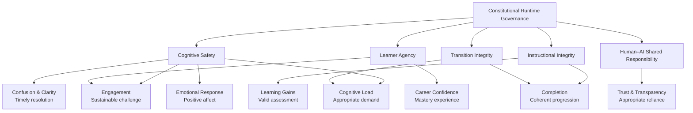
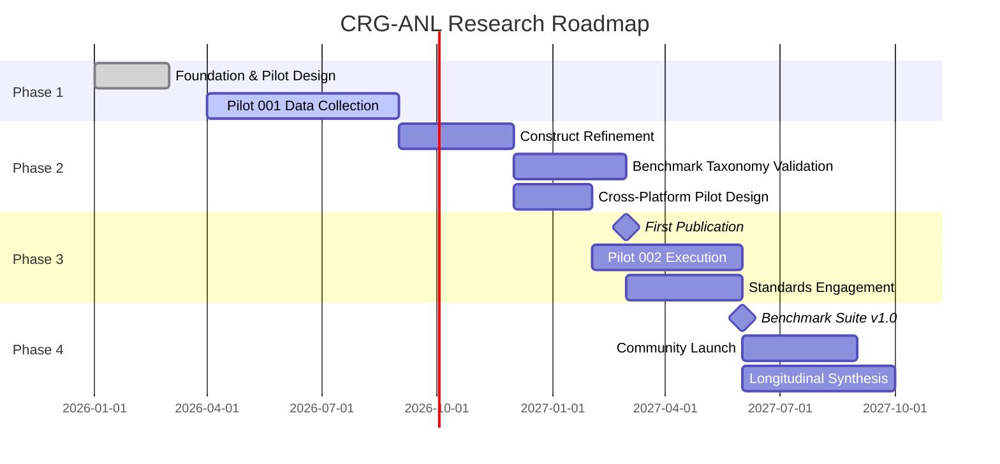

# Research Program

**Artifact:** Research Program  
**Version:** 0.1.0  
**Status:** Foundation complete  
**Canonical:** Yes — governs all downstream research  

---

## Mission

Develop and validate a rigorous, reproducible framework for evaluating how Constitutional Runtime Governance can protect and enhance Cognitive Safety, Instructional Integrity, Learner Agency, and Human–AI Shared Responsibility in AI-native educational environments.

## Vision

AI-native educational systems will become the dominant mode of learning within the next decade.
These systems are not merely digital textbooks with chatbots attached.
They are complex socio-technical environments in which an artificial intelligence participates as an active instructional agent — generating content, scaffolding understanding, assessing knowledge, providing feedback, and adapting to individual learners in real time.

This transformation introduces risks that existing evaluation frameworks do not adequately address.
Model-centric benchmarks measure capability — accuracy, reasoning, latency.
They do not measure the quality of the learning experience.
They do not detect when an AI system overwhelms a learner cognitively, presents speculation as fact, erodes learner autonomy, or fails to maintain epistemic integrity during instructional transitions.

The CRG-ANL Research Program addresses this gap by developing:

1. **A theoretical framework** — Constitutional Runtime Governance — for understanding how principled behavioral constraints can govern AI instructional agents in real time
2. **A construct ontology** — rigorous definitions of Cognitive Safety, Instructional Integrity, Learner Agency, Human–AI Shared Responsibility, and related constructs
3. **A benchmark taxonomy** — a hierarchical evaluation framework with operational definitions and severity classifications
4. **An observation methodology** — structured protocols for capturing and coding instructional events as evidence
5. **A longitudinal case study** — the Quantic MS in AI Engineering as the inaugural experimental environment

## Student Experience Model

The CRG-ANL Research Program investigates how Constitutional Runtime Governance shapes the **student learning experience** in AI-native educational environments.
This section defines the student experience constructs and maps them to the CRG-ANL governance constructs.

### What "Student Experience" Means in This Program

In the context of the Quantic MS in AI Engineering, "student experience" encompasses the full arc of a learner's interaction with the platform — from initial engagement through content consumption, assessment, feedback receipt, and transition to subsequent material — as mediated by AI-generated instructional content, adaptive scaffolding, and automated assessment.

Key characteristics of the Quantic student experience:

| Characteristic | Implication for Student Experience Research |
|---------------|---------------------------------------------|
| **Mobile-first delivery** | Sessions are constrained by screen size, input modality, and attention environment; cognitive load management is critical |
| **Self-paced structure** | Learner controls timing and sequencing, creating natural variation in session length, spacing, and interleaving |
| **AI-generated content** | Explanations, hints, and feedback are generated in real time, introducing variability in quality, accuracy, and pedagogical soundness |
| **Adaptive assessments** | Difficulty and content adjust based on performance, creating personalized but potentially opaque learning paths |
| **Micro-learning format** | Short, focused sessions (~10–15 minutes) demand efficient cognitive load management and clear transitions |
| **Gamification elements** | Points, streaks, and progress indicators may affect motivation, engagement, and emotional response |
| **Limited social layer** | Minimal peer interaction or instructor presence; the AI is the primary instructional agent |

### Student Experience Outcomes

The following outcomes are the measurable student experience phenomena that the CRG-ANL governance constructs are designed to protect and enhance:

| Outcome Domain | Specific Measures | Link to CRG-ANL Constructs |
|---------------|-------------------|---------------------------|
| **Engagement** | Session completion rate, time-on-task, return frequency | Cognitive Safety (sustainable challenge), Learner Agency (meaningful choice) |
| **Cognitive Load** | NASA-TLX mental demand, perceived difficulty | Cognitive Safety (overload prevention), Instructional Integrity (appropriate scaffolding) |
| **Confusion & Clarity** | Self-reported confusion, help-seeking behavior, clarification requests | Cognitive Safety (confusion detection), Instructional Integrity (scaffolding quality) |
| **Trust & Transparency** | Confidence in AI-provided information, perceived transparency | Human–AI Shared Responsibility (visibility), Learner Agency (informed choice) |
| **Emotional Response** | Frustration, anxiety, satisfaction, motivation | Cognitive Safety (emotional safety), Instructional Integrity (feedback quality) |
| **Learning Gains** | Assessment performance, knowledge retention, transfer | Instructional Integrity (assessment validity, scaffolding quality) |
| **Completion & Persistence** | Course completion, lesson progression, dropout points | Cognitive Safety (sustainable engagement), Learner Agency (goal alignment) |
| **Career Confidence** | Self-efficacy in AI skills, perceived career readiness | Instructional Integrity (comprehensive coverage), Learner Agency (mastery experience) |

### Student Experience — Governance Construct Mapping

This model frames every CRG-ANL governance construct as a mechanism that produces (or fails to produce) specific, measurable student experience outcomes.
The research program does not evaluate governance for its own sake — it evaluates governance through its effects on the student learning experience.

## Research Themes

### Theme 1: Constitutional Runtime Governance Theory

Constitutional Runtime Governance is the foundational theoretical contribution of this program.
It posits that AI instructional agents should be governed not merely by static safety filters applied before deployment, nor by post-hoc audits conducted after harm occurs, but by a living constitution — a set of principled behavioral constraints that are applied dynamically during every instructional interaction.

Key theoretical claims:

- Governance must operate at **runtime**, not just design time or audit time
- Governance constraints must be **principled** (derived from learning science and AI safety), not merely technical (output filtering)
- Governance must cover the **full instructional arc** — content, scaffolding, assessment, feedback, navigation, and transitions
- Governance must be **observable** — learners and researchers must be able to see when governance is active, when it is violated, and what intervention occurs

### Theme 2: Cognitive Safety as a First-Class Design Principle

Cognitive Safety is the protection of a learner's cognitive resources from harm caused by AI-mediated instructional design.
It includes protection from cognitive overload, confusion, attention fragmentation, metacognitive disruption, and emotional distress.

Key claims:

- Cognitive Safety is not a luxury feature or compliance checkbox
- Cognitive Safety failures are systematic and predictable, not merely idiosyncratic
- Cognitive Safety can be measured, benchmarked, and improved
- Cognitive Safety is a precondition for effective learning, not a competing objective

### Theme 3: Instructional Integrity in Generative Systems

Instructional Integrity is the property of an AI-native educational system whereby its instructional actions are accurate, coherent, consistent, and aligned with stated learning objectives.
It encompasses assessment integrity, scaffolding integrity, navigation integrity, transition integrity, feedback integrity, and accessibility integrity.

Key claims:

- Generative AI systems are inherently prone to instructional integrity failures (hallucination, inconsistency, epistemic overreach)
- These failures are not merely technical errors but pedagogical harms
- Instructional integrity failures can be detected, classified, and mitigated through runtime governance
- The severity of an integrity failure depends on the learner's cognitive state and the instructional context

### Theme 4: Learner Agency and Human–AI Shared Responsibility

Learner Agency is the capacity of a learner to set, pursue, and revise their own learning goals, strategies, and evaluative standards.
Human–AI Shared Responsibility is the negotiated distribution of cognitive, epistemic, and instructional labor between human and AI.

Key claims:

- Adaptive AI systems can erode learner agency through over-scaffolding, hidden optimization, and opaque decision-making
- Effective Human–AI Shared Responsibility requires transparency, negotiability, and mutual accountability
- Learner Agency can be measured and protected through governance mechanisms
- The Learner Cockpit is an essential interface element for maintaining agency and shared responsibility

### Theme 5: Transition Integrity as a Critical Vulnerability

Transition Integrity is the preservation of cognitive continuity, epistemic orientation, and learner agency during transitions between instructional states.
Transitions — between lessons, topics, difficulty levels, modalities, or human–AI responsibility distributions — are critical vulnerability points where governance failures cluster.

Key claims:

- Transitions are the most common site of cognitive safety failures
- Transition integrity requires explicit governance, not merely smooth animation
- Transition failures have cascading effects on subsequent learning
- Transition integrity can be measured and benchmarked

## Scientific Scope

### In Scope

- Constitutional Runtime Governance theory development and validation
- Cognitive Safety measurement and intervention design
- Instructional Integrity evaluation across all instructional dimensions
- Learner Agency and Human–AI Shared Responsibility measurement
- Transition Integrity analysis and governance
- Benchmark engineering for AI-native educational systems
- Researcher-as-subject methodology refinement
- Longitudinal case studies of AI-native educational platforms

### Out of Scope (Current Phase)

- Implementation of production AI tutoring systems
- Comparative evaluation of LLM architectures for education
- Development of new machine learning models
- Large-scale user studies (N > 1)
- Policy recommendations for educational institutions
- Commercial product development

### Future Scope

- Cross-platform benchmark validation (Coursera, Khan Academy, enterprise training)
- Integration with external AI safety evaluation frameworks
- Community-driven benchmark expansion
- Standards body engagement (IEEE, ISO)

## Long-Term Roadmap

### Phase 1: Foundation (2026 Q1–Q3)

Establish the scientific operating system, complete construct definitions, finalize the benchmark taxonomy, design the observation schema, and execute Pilot 001 (Quantic longitudinal researcher-as-subject study).

**Deliverables:**
- Canonical construct definitions (v1.0)
- Benchmark taxonomy (v1.0)
- Observation schema (v1.0)
- Pilot 001 protocol and initial evidence
- First technical report

### Phase 2: Validation (2026 Q4–2027 Q2)

Refine constructs and taxonomy based on Pilot 001 evidence.
Validate benchmark dimensions against real instructional events.
Design Pilot 002 for cross-platform validation.

**Deliverables:**
- Construct definitions (v1.1)
- Benchmark taxonomy (v1.1)
- Validated observation schema
- Pilot 002 protocol
- Conference submission

### Phase 3: Expansion (2027 Q2–Q4)

Publish first peer-reviewed paper.
Execute Pilot 002 on a second platform.
Begin engagement with standards bodies.

**Deliverables:**
- Peer-reviewed publication (journal or conference)
- Pilot 002 evidence
- Standards proposal draft

### Phase 4: Maturation (2028)

Release benchmark suite v1.0.
Launch community adoption program.
Synthesize longitudinal findings across all pilots.

**Deliverables:**
- Benchmark Suite v1.0
- Open dataset publication
- Community governance framework
- Final longitudinal synthesis

## Experimental Environment

The inaugural experimental environment is the **Quantic School of Business and Technology, MS in Artificial Intelligence Engineering** program.

The Quantic curriculum is **not** the object of study.
It is the **experimental environment**.
The true object of study is the broader class of AI-native educational systems that Quantic represents.

Quantic was selected because it exhibits the key characteristics that make it a productive site for CRG-ANL research:

| Characteristic | Research Relevance |
|----------------|-------------------|
| Mobile-first delivery | Tests cognitive safety on constrained interfaces |
| AI-powered tutoring | Direct evaluation of human–AI instructional interaction |
| Adaptive assessments | Measures personalization effectiveness and assessment integrity |
| Interactive lessons | Captures rich interaction data across instructional dimensions |
| Professional audience | Relevant for enterprise AI training evaluation |
| Self-paced structure | Enables controlled experimental timing and session-level analysis |
| Diverse curriculum | Spans foundational to advanced AI topics, enabling transition integrity analysis |

## Program Identity

This program is the **Constitutional Runtime Governance for AI-Native Learning (CRG-ANL) Research Program**.
Its first case study is Quantic.
Its long-term objective is to establish a widely applicable governance and evaluation framework for AI-assisted learning environments, with Cognitive Safety as a foundational design principle.
Its scientific contribution is reproducible benchmarks and evaluation infrastructure that others can use, test, critique, and extend across different learner populations and educational systems.
