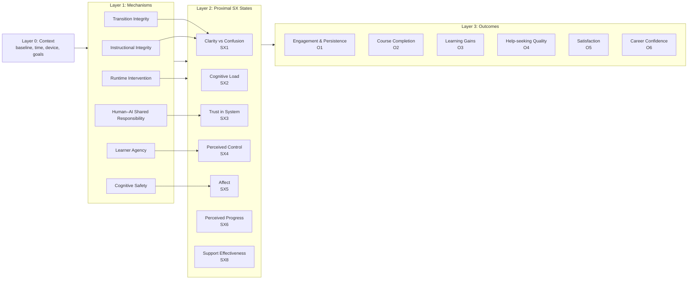

# Student Experience Model

**Artifact:** Student Experience Model  
**Version:** 0.1.0  
**Status:** Draft — awaiting empirical validation  
**Canonical:** Yes — bridges CRG constructs to measurable student outcomes  

**Known Limitations:**
- Causal directions are theoretically motivated but not yet empirically validated
- SX dimension weights are hypothesized; actual relative importance will emerge from pilot data
- The model has not been validated with student populations beyond the researcher-as-subject design

---

## 1. Definition: Student Experience (SX)

**Student Experience (SX):** The learner's perceived and observed quality of learning interaction over time, including clarity, workload, trust, motivation, sense of progress, and confidence — shaped by instructional design, platform behavior, and human/AI support.

In the context of the Quantic MS in AI Engineering, SX specifically encompasses the full arc of a learner's interaction with the AI-native platform: content consumption, assessment, feedback receipt, transition to subsequent material, and help-seeking behavior — all mediated by AI-generated instructional content and adaptive scaffolding.

---

## 2. Model Overview (Layered)

The Student Experience Model organizes phenomena into four layers, from contextual factors through governance mechanisms, proximal experience states, and longitudinal outcomes.

### Layer 0: Context

Contextual factors that shape the baseline student experience but are not directly manipulated by the platform:

| Factor | Description | Example in Quantic |
|--------|-------------|-------------------|
| Learner baseline | Prior knowledge, experience with AI/ML | Career-changer vs. experienced developer |
| Time constraints | Available study time, competing obligations | Full-time professional, family commitments |
| Device | Primary learning device | Mobile phone during commute |
| Location type | Physical learning environment | Home, office, commute, public space |
| Course pacing | Program-imposed timing | Self-paced within term deadlines |
| Stakes | Consequences of performance | Grade requirements, employer sponsorship |

### Layer 1: Mechanisms (CRG-ANL Constructs)

The governance and instructional integrity mechanisms that directly shape student experience. These are the core constructs of the CRG-ANL Research Program:

| Construct | Code | Role in SX |
|-----------|------|-----------|
| Constitutional Runtime Governance | C1 | Overarching framework governing all mechanism behavior |
| Cognitive Safety | C2 | Protects learner from cognitive overload, confusion, emotional distress |
| Instructional Integrity | C3 | Ensures content accuracy, scaffolding quality, assessment validity |
| Learner Agency | C4 | Preserves learner choice, control, and informed decision-making |
| Human–AI Shared Responsibility | C5 | Defines accountability boundaries and escalation pathways |
| Transition Integrity | C6 | Maintains coherence across instructional phase changes |
| Runtime Intervention | C7 | Provides timely, appropriate support without disruption |

### Layer 2: Proximal Student Experience States

Observable and reportable states that emerge "in the moment" during learning interactions:

| SX Dimension | Code | Definition | Typical Trigger |
|-------------|------|-----------|-----------------|
| Clarity vs. Confusion | SX1 | Degree to which learner understands what to do and why | Instructional Integrity events, Transition failures |
| Cognitive Load | SX2 | Perceived mental effort required to process material | Content density, pacing, scaffolding gaps |
| Trust in System | SX3 | Confidence that platform guidance is accurate and helpful | Repeated errors, consistent quality, transparency |
| Perceived Control | SX4 | Sense of agency over learning path and support level | Forced sequencing, lack of override options |
| Affect (frustration/confidence) | SX5 | Emotional response to learning interaction | Safety incidents, success/failure patterns |
| Perceived Progress | SX6 | Sense of forward momentum and accomplishment | Clear milestones, meaningful feedback |
| Support Effectiveness | SX8 | Quality of help received (AI or human) | Response relevance, timeliness, accuracy |

### Layer 3: Outcomes (Longitudinal)

Long-term student experience outcomes that accumulate over multiple sessions:

| Outcome Domain | Code | Definition |
|---------------|------|-----------|
| Engagement & Persistence | O1 | Sustained participation, return behavior, session completion |
| Course/Lesson Completion | O2 | Progression through curriculum, milestone achievement |
| Learning Gains / Assessment | O3 | Demonstrated knowledge acquisition, assessment performance |
| Help-seeking Quality | O4 | Appropriateness and effectiveness of support requests |
| Satisfaction / NPS-like | O5 | Overall program satisfaction, recommendation intent |
| Career Confidence | O6 | Self-efficacy in AI skills, perceived career readiness |

---

## 3. Causal Graph



---

## 4. Construct-to-SX Mapping

The following table maps each CRG-ANL mechanism construct to its primary student experience impacts:

| Mechanism Construct | Primary SX State(s) Impacted | Typical Failure Mode (Experience) | Likely Outcomes Affected |
|--------------------|------------------------------|-----------------------------------|-------------------------|
| Instructional Integrity (C3) | Clarity (SX1), Cognitive Load (SX2), Perceived Progress (SX6) | "I don't know what to do" / "This explanation doesn't make sense" | Persistence (O1), Learning Gains (O3) |
| Transition Integrity (C6) | Clarity (SX1), Perceived Progress (SX6) | "I got lost between lesson → quiz → project" | Completion (O2), Satisfaction (O5) |
| Learner Agency (C4) | Perceived Control (SX4), Trust (SX3) | "System forces path; I can't choose support level" | Engagement (O1), Help-seeking (O4) |
| Cognitive Safety (C2) | Affect (SX5), Trust (SX3) | Anxiety, fear of mistakes, feeling overwhelmed | Persistence (O1), Confidence (O6) |
| Human–AI Shared Responsibility (C5) | Trust (SX3), Support Effectiveness (SX8) | "Unclear who/what is accountable when things go wrong" | Satisfaction (O5), Trust calibration |
| Runtime Intervention (C7) | Clarity (SX1), Cognitive Load (SX2) | "Help arrived too late / was interruptive / was irrelevant" | Performance (O3), Frustration |

---

## 5. SX Dimensions (Canonical)

The following eight SX dimensions are the canonical bridge between CRG governance benchmarks and "student experience." They are used in observation schemas, analysis plans, and measurement instruments.

| ID | Dimension | Definition | Primary Mechanism Link | Candidate Measure |
|----|-----------|-----------|----------------------|-------------------|
| SX1 | Clarity/Coherence | Understanding of goals, expectations, and next steps | Instructional Integrity (C3), Transition Integrity (C6) | Micro-pulse clarity rating (1-5) |
| SX2 | Cognitive Load | Perceived mental effort and resource demands | Cognitive Safety (C2), Instructional Integrity (C3) | NASA-TLX mental demand (0-100) |
| SX3 | Trust & Reliance Calibration | Confidence in system accuracy and appropriate trust level | Human–AI Shared Responsibility (C5) | Trust scale (1-7) |
| SX4 | Perceived Control/Agency | Sense of autonomy over learning process | Learner Agency (C4) | Agency scale (1-7) |
| SX5 | Affective Safety | Emotional comfort, stress, confidence | Cognitive Safety (C2) | Affect scale (1-7) |
| SX6 | Momentum/Flow Across Transitions | Sense of progress and smooth transitions | Transition Integrity (C6) | Progress rating (1-5) |
| SX7 | Perceived Learning/Progress | Subjective sense of knowledge acquisition | Instructional Integrity (C3) | Learning gain self-assessment (1-5) |
| SX8 | Support Effectiveness | Quality of AI/human support received | Human–AI Shared Responsibility (C5), Runtime Intervention (C7) | Support quality rating (1-5) |

---

## 6. Operationalization Path

Each SX dimension can be measured through multiple data streams:

```
┌─────────────────────────────────────────────────────────────────────────────┐
│                    STUDENT EXPERIENCE MEASUREMENT STACK                      │
├──────────────┬─────────────────┬───────────────────┬────────────────────────┤
│ SX Dimension │ Micro-Pulse     │ Post-Session      │ Longitudinal           │
│              │ (in-the-moment) │ (reflective)      │ (pattern-based)        │
├──────────────┼─────────────────┼───────────────────┼────────────────────────┤
│ SX1 Clarity  │ clarity (1-5)   │ "Top confusion    │ Confusion frequency,   │
│              │                 │  moments"         │ resolution rate        │
├──────────────┼─────────────────┼───────────────────┼────────────────────────┤
│ SX2 Load     │ cognitive_load  │ NASA-TLX mental   │ Load trend over        │
│              │ (1-5)           │ demand            │ sessions               │
├──────────────┼─────────────────┼───────────────────┼────────────────────────┤
│ SX3 Trust    │ trust (1-5)     │ Confidence in AI  │ Trust trajectory,      │
│              │                 │ guidance          │ violation recovery     │
├──────────────┼─────────────────┼───────────────────┼────────────────────────┤
│ SX4 Control  │ perceived_ctrl  │ Agency reflection │ Override frequency,    │
│              │ (1-5)           │                   │ path customization     │
├──────────────┼─────────────────┼───────────────────┼────────────────────────┤
│ SX5 Affect   │ affect (1-5)    │ Safety moments    │ Affective pattern      │
│              │                 │                   │ (frustration spikes)   │
├──────────────┼─────────────────┼───────────────────┼────────────────────────┤
│ SX6 Momentum │ N/A (post-hoc)  │ Momentum vs       │ Transition success     │
│              │                 │ friction          │ rate, flow scores      │
├──────────────┼─────────────────┼───────────────────┼────────────────────────┤
│ SX7 Learning │ N/A (post-hoc)  │ Self-assessed     │ Assessment trend,      │
│              │                 │ progress          │ knowledge confidence   │
├──────────────┼─────────────────┼───────────────────┼────────────────────────┤
│ SX8 Support  │ N/A (post-hoc)  │ "What helped      │ Support request →      │
│              │                 │  most"            │ resolution quality     │
└──────────────┴─────────────────┴───────────────────┴────────────────────────┘
```

---

## 7. Relationship to Other Artifacts

| Artifact | Relationship |
|----------|-------------|
| `construct_definitions.md` | SX Model provides the operational bridge from abstract constructs to measurable phenomena |
| `benchmark_taxonomy.md` | Benchmark dimensions map to mechanism constructs; SX Model explains *why* those dimensions matter |
| `observation_schema.yaml` | SX micro-pulse fields operationalize Layer 2 proximal states |
| `measures_and_instruments.md` | Instruments measure SX dimensions at micro-pulse, post-session, and longitudinal levels |
| `analysis_plan.md` | Analyses test mechanism → SX state → outcome causal pathways |
| `hypotheses.md` | Hypotheses can be framed as mechanism → SX → outcome predictions |

---

## 8. Maturity Path

| Phase | Target | Validation Approach |
|-------|--------|-------------------|
| Pilot 001 (months 1-12) | Model structure validated for internal consistency | Researcher-as-subject: do the layers and mappings make sense? |
| Pilot 002 (months 12-18) | SX dimensions distinguish between platform conditions | Expanded sample: do SX measures vary with observed mechanism quality? |
| Cohort study (months 18-30) | Causal pathways empirically tested | Student cohort: longitudinal analysis of mechanism → SX → outcome |
| Publication | Model published as theoretical contribution | Peer review: external validation of structure and operationalization |
