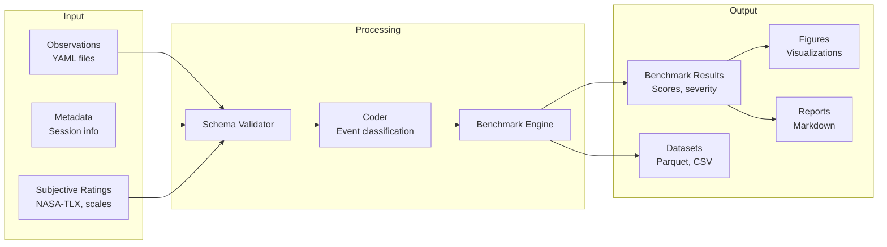
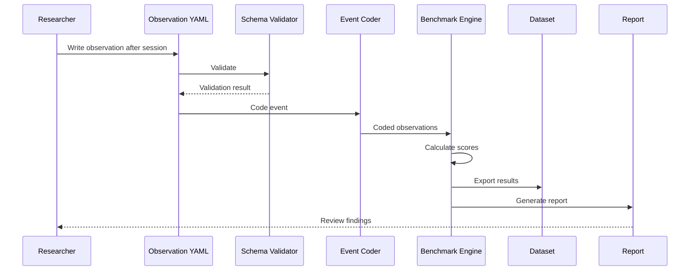

# Architecture

**Purpose:**  
System architecture specifications for the CRG-ANL reference implementation, describing components, interactions, data flows, and design decisions.

**Relationships:**  
- Informed by constructs in `01_science/construct_definitions.md`
- Guides benchmark engine design in `../benchmark_engine/`
- Guides pipeline design in `../evaluation_pipeline/`
- Governed by decision log in `07_project_operations/decision_log.md`

**Inputs:**  
- Construct definitions, benchmark taxonomy, observation schema requirements

**Outputs:**  
- Architecture diagrams, component specifications, data flow documentation

---

## System Overview

The CRG-ANL reference implementation is designed as a modular scientific data pipeline that transforms raw instructional observations into structured evidence, benchmark scores, and research outputs.

## Components

### 1. Schema Validator

Validates all observation YAML files against the canonical observation schema.
Ensures data integrity before processing.

**Responsibilities:**
- Validate YAML syntax
- Validate required fields
- Validate field types and ranges
- Validate cross-field consistency
- Report validation errors with line numbers

### 2. Event Coder

Classifies raw observations into the benchmark taxonomy dimensions.
Assigns severity ratings and maps observations to benchmark dimensions.

**Responsibilities:**
- Classify observation_type against taxonomy
- Map observations to instructional_integrity_dimension
- Assess cognitive_safety_impact
- Evaluate human_agency and shared_responsibility
- Assign severity ratings

### 3. Benchmark Engine

Executes benchmark calculations across all dimensions of the taxonomy.
Aggregates sub-dimension scores into primary dimension scores and overall governance scores.

**Responsibilities:**
- Load coded observations
- Calculate sub-dimension scores
- Aggregate to primary dimension scores
- Calculate overall governance score
- Generate severity distributions
- Produce benchmark reports

### 4. Visualization Generator

Produces publication-ready figures from benchmark results.

**Responsibilities:**
- Generate score charts (bar, radar, time series)
- Generate severity distribution charts
- Generate correlation matrices
- Generate longitudinal trend plots
- Export in publication formats (PNG, SVG, PDF)

### 5. Report Generator

Produces structured research reports from benchmark results and evidence.

**Responsibilities:**
- Generate session reports
- Generate weekly summary reports
- Generate monthly benchmark reports
- Generate pilot study reports
- Export in Markdown format

## Data Flow

## Design Principles

1. **Schema-first:** All data structures are defined in YAML schemas before any processing
2. **Reproducible:** Every transformation is deterministic and version-controlled
3. **Extensible:** New benchmark dimensions can be added without modifying existing code
4. **Transparent:** All processing steps are documented and inspectable
5. **Minimal:** The simplest design that satisfies the scientific requirements
