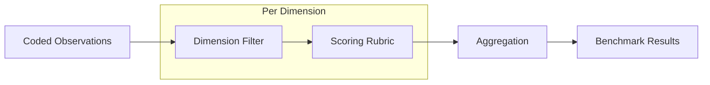

# Benchmark Engine

**Purpose:**  
Design specifications for the benchmark execution engine that applies the CRG-ANL Benchmark Taxonomy to coded observations and produces structured benchmark scores.

**Relationships:**  
- Implements the benchmark taxonomy defined in `01_science/benchmark_taxonomy.md`
- Processes observations coded by the event coder (specified in `../architecture/`)
- Outputs results to `03_evidence/analysis_exports/` and `06_publications/figures/`

---

## Engine Design

### Core Function

The benchmark engine transforms a collection of coded observations into benchmark scores by:

1. Loading observations that match a benchmark dimension's criteria
2. Applying the dimension's scoring rubric to each matching observation
3. Aggregating observation scores into sub-dimension scores
4. Aggregating sub-dimension scores into primary dimension scores
5. Calculating the overall governance score

### Scoring Pipeline



### Aggregation Rules

Defined in `01_science/benchmark_taxonomy.md`:

```
Sub-dimension score = mean(observation severities for that sub-dimension)
Primary dimension score = weighted mean(sub-dimension scores)
Overall score = weighted mean(primary dimension scores)
```

Severity scores (1-5) are normalized to 0-1 scale for reporting.

### Output Format

Benchmark results are exported as YAML with the following structure:

```yaml
benchmark_run:
  run_id: string
  timestamp: ISO 8601
  study: string
  session_range: [start, end]
  schema_version: string

primary_dimensions:
  - name: string
    score: float  # 0-1
    weight: float
    sub_dimensions:
      - name: string
        score: float
        weight: float
        observation_count: integer
        severity_distribution:
          "1": integer
          "2": integer
          "3": integer
          "4": integer
          "5": integer

overall_score: float  # 0-1
classification: string  # Excellent, Good, Moderate, Poor, Critical

metadata:
  total_observations: integer
  coded_observations: integer
  uncoded_observations: integer
```
