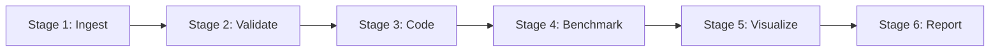

# Evaluation Pipeline

**Purpose:**  
Design specifications for the automated analysis pipeline that transforms raw observations into benchmark results, visualizations, and research reports.

**Relationships:**  
- Processes data from `03_evidence/observations/`
- Uses the benchmark engine defined in `../benchmark_engine/`
- Outputs to `03_evidence/analysis_exports/` and `06_publications/`

**Inputs:**  
- Validated observation YAML files
- Session metadata
- Benchmark taxonomy aggregation rules

**Outputs:**  
- Benchmark result files
- Visualization figures
- Research reports

---

## Pipeline Stages

### Stage 1: Ingest
Load observation YAML files from `03_evidence/observations/`.
Parse metadata, session info, and observation content.

### Stage 2: Validate
Validate each observation against `../schemas/observation_schema.yaml`.
Flag invalid observations for review.

### Stage 3: Code
Classify observations against the benchmark taxonomy.
Assign sub-dimension classifications.
Calculate severity scores.

### Stage 4: Benchmark
Apply benchmark engine to coded observations.
Calculate sub-dimension, primary dimension, and overall scores.
Generate severity distributions.

### Stage 5: Visualize
Generate publication-ready figures:
- Score charts by dimension
- Severity distribution charts
- Longitudinal trend plots
- Correlation matrices

### Stage 6: Report
Generate structured research reports in Markdown.
Include: scores, trends, key findings, methodological notes.

## Execution Modes

- **Session mode:** Analyze a single session
- **Weekly mode:** Analyze all sessions from a week
- **Monthly mode:** Analyze all sessions from a month
- **Full mode:** Analyze all sessions from a study
