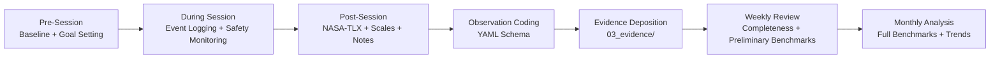

# Pilot 001: Quantic Longitudinal Researcher-as-Subject Pilot

**Pilot ID:** pilot_001  
**Title:** Quantic Longitudinal Researcher-as-Subject Pilot  
**Status:** Protocol complete — awaiting first session  
**Start Date:** TBD (next Quantic course)  
**Expected Duration:** 12-18 months  
**Principal Investigator:** [Researcher Name]  

---

## Start Research Now

**If you are beginning your first session, go directly to [`../../QUICKSTART.md`](../../QUICKSTART.md).**

It contains your minute-by-minute guide for tonight's setup and tomorrow's first session, including copy-paste templates.

**Operational documents in this directory:**

| Document | Purpose | When to Use |
|----------|---------|-------------|
| [`../../QUICKSTART.md`](../../QUICKSTART.md) | **Your minute-by-minute first-session guide** | **Start here** |
| [`protocol.md`](protocol.md) | Complete 4-phase session protocol | Read before first session; reference during sessions |
| [`runbook.md`](runbook.md) | Just-in-time step-by-step operational guide | Keep open during every session |
| [`pilot_report_template.md`](pilot_report_template.md) | Final report template with section guidance | Reference when writing reports |
| [`session_templates/`](session_templates/) | Copy-paste templates for all session artifacts | Copy before each session |

---

## Purpose

This pilot study applies the researcher-as-subject methodology to the Quantic School of Business and Technology's MS in Artificial Intelligence Engineering program.
The purpose is to:

1. Generate the first empirical evidence about Constitutional Runtime Governance in a real AI-native educational environment
2. Validate the CRG-ANL observation schema and benchmark taxonomy against actual instructional events
3. Refine construct definitions based on observed phenomena
4. Establish the feasibility and validity of the researcher-as-subject methodology
5. Produce preliminary benchmark scores for the Quantic platform across all primary dimensions

## Research Questions

This pilot addresses the following P0 (critical) research questions from `01_science/research_questions.md`:

| ID | Question |
|----|----------|
| RQ-C2.1 | What patterns of AI instructional behavior most reliably predict cognitive overload, confusion, and emotional distress? |
| RQ-C2.2 | How effectively do current AI-native educational systems detect and respond to cognitive safety threats in real time? |
| RQ-C3.1 | What is the rate and distribution of instructional integrity failures across the six dimensions? |
| RQ-C3.2 | How does instructional integrity vary by topic domain? |
| RQ-C4.1 | To what extent does an adaptive AI tutoring system preserve or erode learner agency? |
| RQ-C6.1 | What percentage of instructional transitions preserve all three properties of Transition Integrity? |
| RQ-C11.1 | Can the researcher-as-subject methodology produce internally valid, reproducible evidence? |

## Variables

### Independent Variables

| Variable | Levels | Measurement |
|----------|--------|-------------|
| Course phase | Orientation, Core, Concentration, Capstone | Curriculum structure |
| Topic domain | ML, DL, NLP, CV, MLOps, Ethics | Course content |
| Instructional modality | Video, interactive, quiz, reading | Platform interface |
| Difficulty level | Introductory, intermediate, advanced | Content classification |

### Dependent Variables

| Variable | Construct | Measurement |
|----------|-----------|-------------|
| Cognitive Safety Score | C2 | Benchmark aggregation of observations |
| Instructional Integrity Score | C3 | Benchmark aggregation of observations |
| Learner Agency Score | C4 | Benchmark aggregation + subjective scales |
| Human–AI Shared Responsibility Score | C5 | Benchmark aggregation + subjective scales |
| Transition Integrity Score | C6 | Benchmark aggregation of transition observations |
| Overall Governance Score | C1 | Weighted average of primary dimension scores |
| NASA-TLX Mental Demand | C2 | Post-session rating (0-100) |
| NASA-TLX Frustration | C2 | Post-session rating (0-100) |
| Perceived Agency | C4 | Post-session scale (1-7) |
| Perceived Transparency | C1 | Post-session scale (1-7) |

## Data Collection Workflow



### Step-by-Step Session Recording Protocol

Each learning session follows this exact recording sequence. All observation data is stored in `03_evidence/observations/` using the YAML schema defined in `02_engineering/schemas/observation_schema.yaml`.

#### Step 1: Pre-Session (4 minutes)

| Action | Where Recorded | Naming Convention |
|--------|---------------|-------------------|
| Environment setup check | Pre-session form (paper or markdown) | `baseline_YYYY-MM-DD.md` |
| Baseline state (mood, energy, distractions) | Pre-session form | Same file as above |
| Session goal setting (1-3 learning objectives) | Pre-session form | Same file as above |

**Pre-session file location:** `03_evidence/observations/baselines/`

**Template:** See `01_science/measures_and_instruments.md` Section 3 (Pre-Session Baseline Instrument).

#### Step 2: During Session (Real-Time Event Logging)

| Action | Where Recorded | Format |
|--------|---------------|--------|
| Instructional event observed | Real-time log (markdown or notebook) | Timestamp + free-form note |
| Cognitive safety incident | Real-time log + immediate safety notation | `SAFETY:` prefix in log |
| Screenshot captured | Screenshots directory | See naming convention below |
| Session duration tracking | Timer/clock (record start/end times) | Logged in post-session form |

**Real-time log location:** `03_evidence/observations/session_logs/`
**Log naming convention:** `session_log_YYYY-MM-DD_HHMM.md`

**Screenshot naming and linking:**

```
03_evidence/observations/screenshots/
  └── YYYY-MM-DD/
        ├── screenshot_001_contextual_cue.png
        ├── screenshot_002_incorrect_explanation.png
        ├── screenshot_003_missing_scaffold.png
        └── ...
```

Each screenshot filename follows the pattern:
`screenshot_NNN_<brief_description>.png`

In the observation YAML, screenshots are linked via the `supporting_evidence` array:

```yaml
supporting_evidence:
  - type: screenshot
    file: "screenshots/2026-01-15/screenshot_002_incorrect_explanation.png"
    description: "System states 'backpropagation requires manual gradient computation'"
```

#### Step 3: Post-Session (15 minutes)

| Action | Where Recorded | Instrument Reference |
|--------|---------------|---------------------|
| NASA-TLX (6 dimensions) | Post-session form | `measures_and_instruments.md` Section 1 |
| Subjective scales (14 items) | Post-session form | `measures_and_instruments.md` Section 2 |
| Structured research notes | Markdown memo template | `measures_and_instruments.md` Section 5 |
| Observation YAML coding | YAML file per observation | `observation_schema.yaml` |

**Post-session file location:** `03_evidence/observations/post_sessions/`
**Naming convention:** `post_session_YYYY-MM-DD.md`

#### Step 4: Observation YAML Coding

Each significant instructional event is coded into a separate YAML file:

**File location:** `03_evidence/observations/coded/`
**Naming convention:** `obs_YYYYMMDD_NNN_<construct>.yaml`

Where:
- `YYYYMMDD` = session date
- `NNN` = sequential observation number for that date (001, 002, ...)
- `<construct>` = primary construct code (c1_crg, c2_cog_safety, c3_inst_integrity, c4_agency, c5_shared_resp, c6_transition, c10_governance_window)

Example: `obs_20260115_003_c2_cog_safety.yaml`

**Coding process:**
1. Review real-time session log
2. Identify events matching deductive codes (see Codebook)
3. Apply observation schema fields (all mandatory fields required)
4. Link supporting evidence (screenshots, logs)
5. Record observer confidence (1-5 scale)
6. Save to coded observations directory

#### Step 5: Weekly Review and Deposition

Every Sunday:
1. **Completeness check:** Verify all sessions from the week have pre-session, log, post-session, and coded observations
2. **Preliminary benchmarks:** Apply benchmark taxonomy to week's observations (rough scoring acceptable)
3. **Research memo:** Write weekly memo documenting patterns, surprises, protocol issues
4. **Decision documentation:** Any protocol changes or edge cases → `07_project_operations/decision_log.md`

**Weekly memo location:** `03_evidence/memoes/weekly/`
**Naming convention:** `memo_week_NN_YYYY-MM-DD.md`

#### Step 6: Monthly Analysis

First Sunday of each month:
1. **Full benchmark taxonomy:** Apply complete taxonomy with severity classification
2. **Trend analysis:** Review longitudinal patterns across all dimensions
3. **Protocol fidelity audit:** Check adherence to session protocol (target: >90%)
4. **Bias audit:** Review for confirmation bias, recency bias, expectation effects
5. **Monthly report:** Generate structured report

**Monthly report location:** `05_experiments/pilot_001/monthly_reports/`
**Naming convention:** `monthly_report_NN_YYYY-MM.md`

### Codebook Reference

All observation coding uses the deductive codebook defined in `05_experiments/codebook.md`.

**Quick reference:**

| Construct | Code Prefix | Deductive Codes | Primary Use |
|-----------|-------------|-----------------|-------------|
| CRG (C1) | `CRG` | CRG-1, CRG-2, CRG-3 | Governance mechanism presence/absence |
| Cognitive Safety (C2) | `CS` | CS-1 through CS-6 | Overload, confusion, distress events |
| Instructional Integrity (C3) | `II` | II-1 through II-8 | Factual errors, missing scaffolds, etc. |
| Learner Agency (C4) | `LA` | LA-1 through LA-5 | Choice, override, explainability |
| Human-AI Shared Responsibility (C5) | `HSR` | HSR-1 through HSR-5 | Boundary clarity, escalation |
| Transition Integrity (C6) | `TI` | TI-1 through TI-5 | Phase transition quality |

**Coding procedure:**
1. Read session log and review screenshots
2. Identify events matching deductive codes (by construct)
3. If event does not match any deductive code, flag for inductive coding
4. Write inductive code definition (if new pattern)
5. Apply to observation YAML
6. Review with axial coding (cross-construct patterns)

**Codebook maintenance:** After every 5 sessions, review codebook for:
- New inductive codes to promote
- Ambiguous deductive codes to refine
- Unused codes to consider deprecating
- Inter-code consistency

See `05_experiments/codebook.md` for complete code definitions, examples, and maintenance procedures.

## Ethical Considerations

### Researcher Well-being

- Sessions may be paused or terminated if they cause significant distress
- No obligation to complete harmful sessions
- Regular self-checks on research impact on learning quality
- Right to discontinue at any time

### Data Ethics

- All data pertains to the researcher's own experience only
- No data about other students is collected
- Platform terms of service are respected
- Findings reported constructively, not personally

### Publication Ethics

- All findings reported honestly, including negative results
- Limitations disclosed transparently
- Claims proportionate to evidence
- Single-subject limitations acknowledged

## Minimum Viable Pilot Outputs (Success Criteria)

Pilot 001 is considered methodologically successful when the following minimum outputs are produced. These thresholds represent the **minimum** evidence required to validate the research infrastructure; exceeding them is expected.

### Observation Targets

| Metric | Minimum Target | Rationale |
|--------|---------------|-----------|
| Total coded observations | **≥ 150** | Sufficient for preliminary pattern detection across 5 primary dimensions (30 per dimension minimum) |
| Observations per primary dimension | **≥ 25** | Enables basic sub-dimension coverage (5+ per sub-dimension for dimensions with 5 sub-dimensions) |
| Cognitive safety incidents (CS) | **≥ 30** | Core construct requiring robust sample for overload/confusion/distress patterns |
| Instructional integrity failures (II) | **≥ 30** | Core construct requiring robust sample for error/failure pattern detection |
| Sessions with complete data | **≥ 30** | Pre-session + during + post-session + coding all complete (protocol fidelity > 90%) |
| Screenshot evidence linked | **≥ 50** | Visual evidence supports ~1/3 of coded observations |

**Observation accumulation rate estimate:**
- Expected sessions per month: 6-10 (2-3 per week)
- Expected observations per session: 2-5
- Time to reach 150 observations: 5-8 months
- Buffer for incomplete sessions: +2 months
- **Expected achievement:** Months 8-10 of the pilot

### Memo Targets

| Metric | Minimum Target | Content Requirements |
|--------|---------------|---------------------|
| Weekly research memos | **≥ 20** | Pattern notes, surprises, protocol issues, emerging themes |
| Monthly analysis reports | **≥ 6** | Full benchmark application, trend analysis, bias audit |
| Methodological memos | **≥ 3** | Codebook evolution, schema revisions, protocol changes |
| Construct refinement memos | **≥ 2** | Evidence-driven construct definition revisions |

**Memo accumulation rate estimate:**
- Weekly memos: 1 per week → 20 memos = 20 weeks (~5 months)
- Monthly reports: 1 per month → 6 reports = 6 months
- Combined with methodological and construct memos: **6-8 months total**

### Taxonomy Stress Test

The benchmark taxonomy (defined in `01_science/benchmark_taxonomy.md`) must be stress-tested for coverage and discriminability:

| Stress Test Component | Success Criterion | When Performed |
|----------------------|-------------------|----------------|
| Coverage test | **≥ 90% of observations** map unambiguously to at least one benchmark dimension | Monthly (starting Month 2) |
| Ambiguity log | All ambiguous observations documented with reason for ambiguity | Ongoing |
| Redundancy check | No observation maps to > 3 dimensions without justification | Monthly |
| Severity calibration | Severity ratings (1-4) show **discriminability** (not all 2s and 3s) | Monthly |
| Aggregation validity | Weighted aggregation produces meaningful variation across sessions | Month 4+ |
| Taxonomy revision log | All taxonomy changes documented with justification | Ongoing |

**Stress test deliverable:** `05_experiments/pilot_001/taxonomy_stress_test_report.md`

This report documents:
- Coverage statistics (observations mapped / total observations)
- Ambiguity cases and proposed resolutions
- Severity distribution analysis
- Proposed taxonomy revisions
- Confidence in each primary dimension score

### Pilot Report Template

A comprehensive pilot report template must be developed and validated by Month 6:

| Report Section | Content | Status Target |
|---------------|---------|---------------|
| Executive summary | Key findings, limitations, next steps | Draft by Month 4 |
| Methodology | Researcher-as-subject protocol, instruments, coding | Stable by Month 3 |
| Descriptive statistics | Observation counts, session coverage, data quality | Updated monthly |
| Benchmark results | Scores per primary dimension, trends over time | Updated monthly |
| Construct validation | Evidence for/against construct definitions | Draft by Month 6 |
| Taxonomy assessment | Coverage, discriminability, proposed revisions | Draft by Month 6 |
| Methodology assessment | Feasibility, validity threats, recommendations | Draft by Month 8 |
| Appendices | Codebook version, instrument versions, decision log | Updated ongoing |

**Pilot report location:** `05_experiments/pilot_001/pilot_report.md`

The pilot report serves three purposes:
1. **Internal:** Document what worked, what didn't, and what changed
2. **Publication:** Form the basis for the first conference submission
3. **Program:** Inform the design of Pilot 002 and subsequent studies

### Success Checklist

Pilot 001 is successful when ALL of the following are true:

- [ ] **≥ 150 coded observations** deposited in `03_evidence/observations/coded/`
- [ ] **≥ 30 sessions** with complete data (pre + during + post + coding)
- [ ] **≥ 20 weekly memos** in `03_evidence/memoes/weekly/`
- [ ] **≥ 6 monthly reports** in `05_experiments/pilot_001/monthly_reports/`
- [ ] **Taxonomy stress test report** completed with ≥ 90% coverage
- [ ] **Pilot report** drafted with all sections at least in outline
- [ ] **Codebook** refined through at least 3 maintenance cycles
- [ ] **≥ 3 ADRs** in `07_project_operations/decision_log.md` documenting major protocol changes
- [ ] **No critical safety incidents** (researcher well-being maintained throughout)
- [ ] **IRB determination** obtained (exempt or approved)

### Failure Modes and Contingencies

| Risk | Indicator | Contingency |
|------|-----------|-------------|
| Observation rate too low | < 2 obs/session for 4+ weeks | Expand "significant event" threshold; include more routine observations |
| Taxonomy coverage < 80% | Monthly coverage test fails | Emergency taxonomy revision; consider adding sub-dimensions |
| Researcher burnout | Missed sessions for 2+ weeks | Pause protocol; reduce session frequency; consult advisor |
| Platform changes | Quantic interface changes significantly | Document change; assess impact on comparability; adapt instruments |
| Schema inadequacy | Repeated difficulty coding | Emergency schema revision; document in decision log |

## Expected Outputs

| Output | Location | Timeline |
|--------|----------|----------|
| Observation dataset | `03_evidence/observations/` | Ongoing |
| Benchmark scores | `03_evidence/analysis_exports/` | Monthly |
| Monthly reports | `05_experiments/pilot_001/monthly_reports/` | Monthly |
| Technical report | `06_publications/papers/` | After core courses |
| Conference submission | External venue | 2027 Q2 |
| Journal manuscript | External venue | 2027 Q3 |

## Limitations

1. **Single subject:** Findings may not generalize to other learners
2. **Expert bias:** Researcher's expertise may influence observation sensitivity
3. **Platform specificity:** Findings are specific to the Quantic platform
4. **Self-report bias:** Subjective ratings may be influenced by researcher expectations
5. **Hawthorne effect:** Being observed (even by self) may change behavior

These limitations are mitigated through the bias mitigation protocol defined in `01_science/study_protocol.md` and will be acknowledged in all publications.

## Operational Documents

| Document | Purpose | When to Use |
|----------|---------|-------------|
| `protocol.md` | Complete session protocol with all 4 phases | Read before first session; reference during sessions |
| `runbook.md` | Just-in-time step-by-step guide | Keep open during every session |
| `pilot_report_template.md` | Final report template with guidance | Reference when writing monthly reports and final report |

## Study Protocol Version

This pilot follows Study Protocol v0.1.0 defined in `01_science/study_protocol.md`.
Any protocol deviations will be documented in `07_project_operations/decision_log.md`.

## Build Contract

This pilot is established under **BC-001: Scientific Operating System** and executed under **BC-005: Pilot 001 Execution Kit** and **BC-010: Pilot 001 Run + Pilot Report**.
See `BUILD_CONTRACTS.md` for the full build contract registry.
