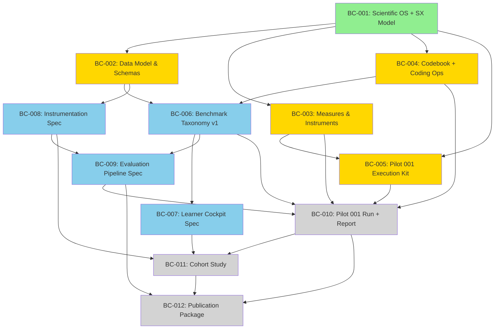

# CRG-ANL Build Contracts

**Artifact:** Master Build Contract Registry  
**Version:** 0.1.0  
**Status:** Active — 8 of 12 contracts drafted, 4 in planning  
**Canonical:** Yes — governs all repository development  

---

## Overview

The CRG-ANL Research Program is constructed through a sequence of **12 Build Contracts** (BC-001 through BC-012). Each contract defines a discrete deliverable phase, ensuring that scientific foundations precede engineering specifications, which precede executable systems.

This document serves as the master registry, tracking:
- Contract scope and deliverables
- Artifact status across contracts
- Dependencies and sequencing
- Current completion state

### Design Philosophy

> *"Science first, then data, then instrumentation, then execution."*

The build contract sequence mirrors how mature research laboratories construct durable infrastructure:

1. **Scientific foundation** (BC-001–003): Establish what is being studied, how it is defined, and how it is measured
2. **Data and evidence infrastructure** (BC-004–006): Build the pipelines for capturing, coding, and benchmarking evidence
3. **System specifications** (BC-007–009): Design the instruments, cockpits, and evaluation pipelines (still no code)
4. **Execution and expansion** (BC-010–012): Run pilots, expand to cohorts, and publish

---

## Build Contract Sequence

| Contract | Title | Status | Core Deliverable |
|----------|-------|--------|-----------------|
| BC-001 | Scientific Operating System + SX Model | **Complete** | 7 workstreams, all canonical artifacts v0.1 |
| BC-002 | Canonical Data Model & Schemas | **Draft** | Finalized observation, participant, session, consent schemas |
| BC-003 | Measures & Instruments | **Draft** | Validated instrument suite, administration protocols |
| BC-004 | Qualitative Codebook + Coding Ops | **Draft** | Versioned codebook, reliability procedures, coding workflow |
| BC-005 | Pilot 001 Execution Kit | **Draft** | Operational templates, runbook, evidence linking conventions |
| BC-006 | Benchmark Taxonomy v1 + Spec Template | **Planned** | Complete taxonomy with aggregation rules, benchmark spec template |
| BC-007 | Learner Cockpit Specification | **Planned** | UX specification, governance window design (no implementation) |
| BC-008 | Instrumentation Specification | **Planned** | Event model, construct mapping, data flow architecture |
| BC-009 | Evaluation Pipeline Specification | **Planned** | Metrics definitions, analysis notebook plan, visualization specs |
| BC-010 | Pilot 001 Run + Pilot Report | **Pending** | Execute Pilot 001, produce pilot report |
| BC-011 | Expand to Student Cohort Study | **Pending** | IRB-ready package, recruitment, consent, multi-participant protocols |
| BC-012 | Publication Package v1 | **Pending** | Paper outline, figures/tables plan, preregistration |

---

## BC-001: Scientific Operating System + SX Model

**Status:** ✅ Complete  
**Date Completed:** 2026-07-20  
**Scope:** Establish the canonical scientific foundation for the entire research program

### Deliverables

All artifacts delivered at v0.1 (Draft) status with Known Limitations sections:

#### 01_science/ — Canonical Scientific Knowledge

| Artifact | Status | Description |
|----------|--------|-------------|
| `research_program.md` | ✅ Complete | Mission, vision, scope, student experience model section |
| `student_experience_model.md` | ✅ Complete | Standalone 4-layer SX model with causal graph, construct mappings, operationalization path |
| `construct_definitions.md` | ✅ Complete | 11 canonical constructs with definitions, theoretical motivation, relationships, examples |
| `research_questions.md` | ✅ Complete | Prioritized research questions organized by construct |
| `hypotheses.md` | ✅ Complete | 10 testable hypotheses with construct→proxy→direction and adjudication data |
| `benchmark_taxonomy.md` | ✅ Complete | 5 primary dimensions, 22 sub-dimensions, severity classifications |
| `measures_and_instruments.md` | ✅ Complete | 6 instruments (NASA-TLX, subjective scales, baseline, goal setting, research notes, observation coding), composite scales, administration schedule |
| `analysis_plan.md` | ✅ Complete | Qualitative coding (3-pass), quantitative analysis (6 levels), benchmark calculation, triangulation, visualization |
| `threats_to_validity.md` | ✅ Complete | 7 threat categories with risk levels and mitigations |
| `study_protocol.md` | ✅ Complete | Researcher-as-subject protocol, bias mitigation, data quality procedures |
| `publication_roadmap.md` | ✅ Complete | Planned publications, venues, timelines |
| `research_glossary.md` | ✅ Complete | Standardized terminology |

#### 02_engineering/ — Architecture and Specifications

| Artifact | Status | Description |
|----------|--------|-------------|
| `README.md` | ✅ Complete | Architecture/specs-only clarification |
| `architecture/README.md` | ✅ Complete | System architecture overview |
| `benchmark_engine/README.md` | ✅ Complete | Benchmark engine specifications |
| `instrumentation/README.md` | ✅ Complete | Instrumentation specifications |
| `learner_cockpit/README.md` | ✅ Complete | Learner cockpit UX specifications |
| `evaluation_pipeline/README.md` | ✅ Complete | Evaluation pipeline specifications |
| `runtime_governance/README.md` | ✅ Complete | Runtime governance specifications |
| `schemas/README.md` | ✅ Complete | Schema registry overview |
| `schemas/observation_schema.yaml` | ✅ Complete | 25+ field observation schema with SX micro-pulse, privacy, confidence fields |
| `schemas/session_schema.yaml` | ✅ Complete | Session metadata and summary schema |
| `schemas/participant_schema.yaml` | ✅ Complete | Participant metadata and baseline schema |
| `schemas/benchmark_result_schema.yaml` | ✅ Complete | Benchmark result structure |
| `schemas/experiment_schema.yaml` | ✅ Complete | Experiment metadata schema |

#### 03_evidence/ through 07_project_operations/ — All Directories

| Workstream | Status | Description |
|-----------|--------|-------------|
| `03_evidence/` | ✅ Complete | Directory structure with READMEs for observations, coded_events, screenshots, field_notes, datasets, analysis_exports |
| `04_literature/` | ✅ Complete | Directory structure with READMEs for papers, books, quantic, standards, annotated_bibliography, reading_maps |
| `05_experiments/` | ✅ Complete | pilot_001 (detailed), pilot_002 (template), pilot_templates, colab, analysis, results; plus `codebook.md` |
| `06_publications/` | ✅ Complete | Directory structure with READMEs for papers, figures, tables, supplementary, presentations |
| `07_project_operations/` | ✅ Complete | decision_log.md (7 ADRs), change_log.md, meeting_notes.md, roadmap.md, governance.md, ethics_protocol.md, data_management_plan.md, irb_readiness.md |

#### Root Files

| Artifact | Status | Description |
|----------|--------|-------------|
| `README.md` | ✅ Complete | Project overview, artifact status levels, quick start |
| `ARCHITECTURE.md` | ✅ Complete | System architecture document |
| `CONTRIBUTING.md` | ✅ Complete | Contribution guidelines, Draft artifact policy |
| `BUILD_CONTRACTS.md` | ✅ Complete | This document |

### Dependencies
None — this is the foundation contract.

### Success Criteria
- [x] All 7 workstreams established with READMEs
- [x] All canonical scientific artifacts created at v0.1
- [x] Observation schema includes SX micro-pulse, privacy, and confidence fields
- [x] Ethics, data management, and IRB readiness documented
- [x] Decision log established with ADR template
- [x] No placeholder files or TODOs (complete Draft documents with Known Limitations)

---

## BC-002: Canonical Data Model & Schemas

**Status:** 📝 Draft — Schema structures exist, finalization pending pilot feedback  
**Target Completion:** After Pilot 001 Month 2  
**Scope:** Finalize all data schemas based on initial pilot experience

### Deliverables

| Artifact | Current Status | Target Status |
|----------|---------------|---------------|
| `observation_schema.yaml` | v0.1 Draft | v1.0 Final |
| `participant_schema.yaml` | v0.1 Draft | v1.0 Final |
| `session_schema.yaml` | v0.1 Draft | v1.0 Final |
| `consent_schema.yaml` | 🆕 Not created | v1.0 Final |
| `benchmark_result_schema.yaml` | v0.1 Draft | v1.0 Final |
| `evidence_linking_conventions.md` | 🆕 Not created | v1.0 Final |

### Key Activities
- Validate schema fields against actual observation data
- Add/remove fields based on coding experience
- Establish evidence linking conventions (screenshot → observation → session)
- Create consent tracking schema for cohort expansion
- Document schema versioning policy

### Dependencies
- BC-001 (all schemas drafted)
- Pilot 001 Month 1-2 data (for validation)

---

## BC-003: Measures & Instruments

**Status:** 📝 Draft — Instruments defined, validation pending  
**Target Completion:** After Pilot 001 Month 3  
**Scope:** Validate and refine all measurement instruments

### Deliverables

| Artifact | Current Status | Target Status |
|----------|---------------|---------------|
| `measures_and_instruments.md` | v0.9 Draft | v1.0 Validated |
| Micro-pulse instrument | Defined | Validated for sensitivity |
| NASA-TLX administration | Standard | Adapted for context |
| Subjective scales (14 items) | Draft | Validated for internal consistency |
| Composite scales | Defined | Validated (Agency, Transparency, Trust, Satisfaction indices) |
| Administration schedule | Estimated | Validated for feasibility |

### Key Activities
- Assess instrument sensitivity (do scales capture variation?)
- Evaluate administration burden (timing, fatigue)
- Check for floor/ceiling effects
- Refine items based on researcher experience
- Document instrument versioning

### Dependencies
- BC-001 (instruments drafted)
- Pilot 001 Month 1-3 data (for validation)

---

## BC-004: Qualitative Codebook + Coding Ops

**Status:** 📝 Draft — Codebook created, reliability procedures pending  
**Target Completion:** After Pilot 001 Month 4  
**Scope:** Establish versioned codebook with reliability procedures

### Deliverables

| Artifact | Current Status | Target Status |
|----------|---------------|---------------|
| `codebook.md` | v0.1 Draft | v1.0 Stable |
| Intra-coder reliability procedure | Defined | Executed (10% recode) |
| Codebook versioning policy | Defined | Implemented |
| Inductive code promotion rules | Defined | Tested |
| Axial coding procedure | Defined | Applied |

### Key Activities
- Execute intra-coder reliability check (recode 10% sample after 14 days)
- Promote validated inductive codes to deductive status
- Refine ambiguous deductive codes
- Document codebook changes via ADR

### Dependencies
- BC-001 (codebook drafted)
- Pilot 001 Month 1-4 observations (for reliability testing)

---

## BC-005: Pilot 001 Execution Kit

**Status:** 📝 Draft — Templates created, operational refinement pending  
**Target Completion:** Before Pilot 001 first session  
**Scope:** Complete operational kit for executing Pilot 001

### Deliverables

| Artifact | Current Status | Target Status |
|----------|---------------|---------------|
| `protocol.md` | ✅ Complete | v1.0 Final |
| `runbook.md` | ✅ Complete | v1.0 Final |
| `pilot_report_template.md` | ✅ Complete | v1.0 Final |
| Evidence linking conventions | Documented | Tested and refined |
| File naming conventions | Documented | Automated where possible |
| Data validation checklist | Defined | In use |

### Key Activities
- Field-test protocol with first 3 sessions
- Refine timing estimates
- Validate file naming and storage workflow
- Confirm data validation procedures

### Dependencies
- BC-001 through BC-004 (all templates and instruments)

---

## BC-006: Benchmark Taxonomy v1 + Spec Template

**Status:** 📋 Planned — Taxonomy drafted, aggregation rules pending  
**Target Completion:** After Pilot 001 Month 4  
**Scope:** Complete benchmark taxonomy with operational aggregation rules

### Deliverables

| Artifact | Current Status | Target Status |
|----------|---------------|---------------|
| `benchmark_taxonomy.md` | v0.1 Draft | v1.0 Complete |
| Aggregation rules | Defined | Validated with real data |
| Severity calibration | Hypothesized | Empirically validated |
| Benchmark spec template | 🆕 Not created | v1.0 Final |
| Taxonomy stress test report | 🆕 Not created | Complete |

### Key Activities
- Apply taxonomy to Pilot 001 observations
- Validate coverage (≥ 90% of observations mappable)
- Calibrate severity ratings
- Establish aggregation formula validation
- Document taxonomy limitations

### Dependencies
- BC-001 (taxonomy drafted)
- Pilot 001 Month 1-4 observations (for validation)

---

## BC-007: Learner Cockpit Specification

**Status:** 📋 Planned  
**Target Completion:** Month 6  
**Scope:** Design specification for the Learner Cockpit governance interface

### Deliverables

| Artifact | Description |
|----------|-------------|
| UX specification document | Wireframes, interaction flows, accessibility requirements |
| Governance window specification | Persistent runtime governance window design |
| Control surface specification | Learner-facing controls (pause, explain, adjust, escalate) |
| Feedback loop specification | How learner actions influence system behavior |

### Key Activities
- Design governance window UX (information architecture, visual hierarchy)
- Specify control surfaces (what learners can adjust, when, how)
- Design feedback loops (learner action → system response)
- Establish accessibility requirements

### Dependencies
- BC-001 (construct definitions for cockpit-relevant constructs)
- BC-006 (benchmark dimensions that cockpit should display)

---

## BC-008: Instrumentation Specification

**Status:** 📋 Planned  
**Target Completion:** Month 6  
**Scope:** Design specification for the instrumentation framework

### Deliverables

| Artifact | Description |
|----------|-------------|
| Event model specification | What events are captured, when, how |
| Construct mapping specification | How events map to constructs |
| Data flow architecture | From event capture to evidence deposition |
| Privacy-preserving design | How to instrument without compromising learner privacy |

### Key Activities
- Define event taxonomy (what constitutes an "event")
- Specify construct-event mapping rules
- Design data flow from capture to storage
- Establish privacy-preserving instrumentation principles

### Dependencies
- BC-002 (finalized schemas)
- BC-006 (benchmark taxonomy)

---

## BC-009: Evaluation Pipeline Specification

**Status:** 📋 Planned  
**Target Completion:** Month 8  
**Scope:** Design specification for the evaluation pipeline

### Deliverables

| Artifact | Description |
|----------|-------------|
| Metrics definitions | How each benchmark metric is calculated |
| Analysis notebook plan | Planned Jupyter/Colab notebooks for each analysis |
| Visualization specifications | What charts, tables, and figures to generate |
| Report generation specification | Automated report structure and content |

### Key Activities
- Define all evaluation metrics with formulas
- Plan analysis notebooks (descriptive, diagnostic, predictive)
- Specify visualization requirements
- Design automated reporting pipeline

### Dependencies
- BC-006 (benchmark taxonomy)
- BC-008 (instrumentation specification)
- Pilot 001 data (for validating metrics)

---

## BC-010: Pilot 001 Run + Pilot Report

**Status:** ⏳ Pending  
**Target Completion:** Months 10-12  
**Scope:** Execute Pilot 001 and produce the pilot report

### Deliverables

| Artifact | Description |
|----------|-------------|
| Complete observation dataset | ≥ 150 coded observations |
| Complete session dataset | ≥ 30 complete sessions |
| Weekly memos | ≥ 20 research memos |
| Monthly reports | ≥ 6 monthly analysis reports |
| Taxonomy stress test report | Coverage, discriminability, proposed revisions |
| `pilot_report.md` | Comprehensive pilot report following template |
| Updated constructs | Evidence-driven construct refinements |
| Updated schemas | Schema revisions based on field experience |

### Success Criteria
- All minimum viable outputs achieved (see `pilot_001/README.md`)
- Pilot report complete with all sections
- Taxonomy stress test ≥ 90% coverage
- No critical safety incidents
- IRB determination obtained

### Dependencies
- BC-001 through BC-009 (all infrastructure)
- 10-12 months of data collection

---

## BC-011: Expand to Student Cohort Study

**Status:** ⏳ Pending  
**Target Completion:** Months 12-18  
**Scope:** Design and prepare for multi-participant cohort study

### Deliverables

| Artifact | Description |
|----------|-------------|
| IRB-ready protocol | Full IRB submission package |
| Recruitment plan | Participant recruitment strategy |
| Consent framework | Multi-participant consent procedures |
| Data management plan (updated) | Multi-participant data governance |
| Privacy protocol | Participant anonymity and data protection |
| Cohort study design | Between-subjects or within-subjects design |
| Power analysis | Sample size estimation |

### Key Activities
- Prepare IRB submission
- Design recruitment strategy
- Develop multi-participant consent procedures
- Update data management for cohort scale
- Conduct power analysis for sample size

### Dependencies
- BC-010 (Pilot 001 findings inform cohort design)
- Institutional IRB requirements

---

## BC-012: Publication Package v1

**Status:** ⏳ Pending  
**Target Completion:** Months 18-24  
**Scope:** Produce publication-ready research outputs

### Deliverables

| Artifact | Description |
|----------|-------------|
| Conference paper | Pilot 001 methods and findings |
| Journal manuscript | Extended analysis and theoretical contribution |
| Figure set | Publication-quality figures |
| Table set | Publication-quality tables |
| Supplementary materials | Codebook, instruments, decision log |
| Preregistration | Optional preregistration of hypotheses |

### Target Venues

| Publication Type | Target Venue | Timeline |
|-----------------|-------------|----------|
| Conference paper | CHI, EDM, AIED, or FAccT 2027 | 2027 Q2 |
| Journal manuscript | Computers & Education, Learning and Instruction, or AI in Education | 2027 Q3 |

### Dependencies
- BC-010 (Pilot 001 data and report)
- BC-011 (Cohort study design, if included in publications)

---

## Artifact-to-Build-Contract Matrix

The following matrix maps every repository artifact to its build contract lifecycle. **Legend:** C = Create, U = Update, F = Finalize.

| Artifact | BC-001 | BC-002 | BC-003 | BC-004 | BC-005 | BC-006 | BC-007 | BC-008 | BC-009 | BC-010 | BC-011 | BC-012 |
|----------|--------|--------|--------|--------|--------|--------|--------|--------|--------|--------|--------|--------|
| **01_science/research_program.md** | C | U | U | | | | | | | U | U | |
| **01_science/student_experience_model.md** | C | U | U | | | | | | | U | U | |
| **01_science/construct_definitions.md** | C | U | U | U | | U | | | | U | U | |
| **01_science/research_questions.md** | C | | | | | | | | | | U | |
| **01_science/hypotheses.md** | C | | U | | | | | | | U | U | |
| **01_science/benchmark_taxonomy.md** | C | | | | | F | | | | U | U | |
| **01_science/measures_and_instruments.md** | C | | F | U | | | | | | U | U | |
| **01_science/analysis_plan.md** | C | | U | U | | | | | F | U | U | |
| **01_science/threats_to_validity.md** | C | | | | | | | | | U | U | |
| **01_science/study_protocol.md** | C | | | | U | | | | | F | U | |
| **01_science/publication_roadmap.md** | C | | | | | | | | | | | U |
| **01_science/research_glossary.md** | C | U | U | U | U | U | U | U | U | U | U | U |
| **02_engineering/schemas/observation_schema.yaml** | C | F | U | U | | | | | | U | U | |
| **02_engineering/schemas/participant_schema.yaml** | C | F | U | | | | | | | | F | |
| **02_engineering/schemas/session_schema.yaml** | C | F | U | | U | | | | | | U | |
| **02_engineering/schemas/benchmark_result_schema.yaml** | C | U | | | | F | | | | | | |
| **02_engineering/schemas/consent_schema.yaml** | | C | | | | | | | | | F | |
| **02_engineering/schemas/evidence_linking_conventions.md** | | C | | | U | | | | | | | |
| **02_engineering/architecture/** | C | | | | | | U | U | U | | | |
| **02_engineering/benchmark_engine/** | C | | | | | U | | | | | | |
| **02_engineering/instrumentation/** | C | | | | | | | F | | | | |
| **02_engineering/learner_cockpit/** | C | | | | | | F | | | | | |
| **02_engineering/evaluation_pipeline/** | C | | | | | | | | F | | | |
| **02_engineering/runtime_governance/** | C | | | | | | | U | | | | |
| **03_evidence/** (structure + READMEs) | C | U | | | F | | | | | | | |
| **04_literature/** (structure + READMEs) | C | | | | | | | | | | | U |
| **05_experiments/codebook.md** | C | | | F | | | | | | | | |
| **05_experiments/pilot_001/protocol.md** | | | | | C | | | | | U | | |
| **05_experiments/pilot_001/runbook.md** | | | | | C | | | | | U | | |
| **05_experiments/pilot_001/pilot_report_template.md** | | | | | C | | | | | F | | |
| **05_experiments/pilot_001/pilot_report.md** | | | | | | | | | | C | | |
| **05_experiments/pilot_001/taxonomy_stress_test_report.md** | | | | | | C | | | | | | |
| **05_experiments/pilot_001/monthly_reports/** | | | | | U | U | | | | F | | |
| **05_experiments/pilot_002/** (template) | C | | | | | | | | | | U | |
| **05_experiments/pilot_templates/** | C | | | | U | | | | | | | |
| **05_experiments/colab/** | C | | | | | | | | | U | U | |
| **05_experiments/analysis/** | C | | | | | | | | | F | F | |
| **05_experiments/results/** | | | | | | | | | | C | C | F |
| **06_publications/** (structure + READMEs) | C | | | | | | | | | | | C |
| **06_publications/papers/** | | | | | | | | | | | | C |
| **06_publications/figures/** | | | | | | | | | | | | C |
| **06_publications/tables/** | | | | | | | | | | | | C |
| **06_publications/supplementary/** | | | | | | | | | | | | C |
| **06_publications/presentations/** | | | | | | | | | | | | C |
| **07_project_operations/decision_log.md** | C | U | U | U | U | U | U | U | U | U | U | U |
| **07_project_operations/adr_template.md** | C | | | | | | | | | | | |
| **07_project_operations/change_log.md** | C | U | U | U | U | U | U | U | U | U | U | U |
| **07_project_operations/ethics_protocol.md** | C | | | | | | | | | U | F | |
| **07_project_operations/data_management_plan.md** | C | U | | | | | | | | U | F | |
| **07_project_operations/irb_readiness.md** | C | | | | | | | | | U | F | |
| **07_project_operations/meeting_notes.md** | C | U | U | U | U | U | U | U | U | U | U | U |
| **07_project_operations/roadmap.md** | C | U | U | U | U | U | U | U | U | U | U | U |
| **07_project_operations/governance.md** | C | | | | | | | | | | U | |
| **Root README.md** | C | U | U | U | U | U | U | U | U | U | U | U |
| **Root ARCHITECTURE.md** | C | U | | | | | U | U | U | | | |
| **Root CONTRIBUTING.md** | C | | | | | | | | | | | |
| **Root BUILD_CONTRACTS.md** | C | U | U | U | U | U | U | U | U | U | U | U |

---

## Mermaid: Build Contract Dependency Graph

**Legend:**
- 🟩 Green = Complete
- 🟨 Yellow = Draft (in progress)
- 🟦 Blue = Planned (ready to start)
- ⬜ Gray = Pending (dependencies not met)

---

## Current Status Summary

As of 2026-07-20:

| Metric | Value |
|--------|-------|
| Contracts complete | 1 of 12 (BC-001) |
| Contracts in draft | 4 of 12 (BC-002 through BC-005) |
| Contracts planned | 4 of 12 (BC-006 through BC-009) |
| Contracts pending | 3 of 12 (BC-010 through BC-012) |
| Total artifacts created | 70+ files |
| Artifacts at v0.1 Draft | 70+ |
| Artifacts finalized | 0 (finalization requires pilot data) |
| Ready for first session | ✅ Yes — all operational templates complete |
