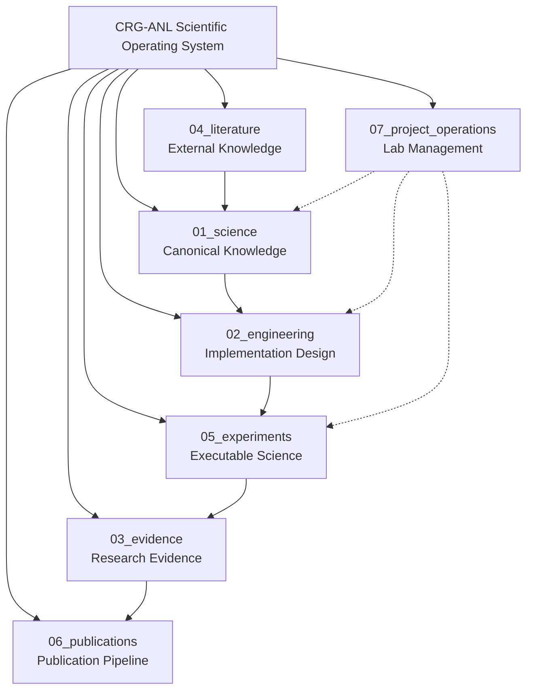

# CRG-ANL: Start Here

**This is the fastest way to begin using CRG-ANL.** If you want everything else, read the rest of this file. You can also skip directly to what matters for your goal below.

---

## 🚀 One-Minute Entry Points

| I want to... | Go here → |
|--------------|------------|
| **Do a research session TODAY** | [`QUICKSTART.md`](QUICKSTART.md) — 10-minute setup, copy-paste templates |
| **Understand what this project is** | Section below: **What CRG-ANL Is** |
| **Contribute code or docs** | [`CONTRIBUTING.md`](CONTRIBUTING.md) + this file's "How to Contribute" section |
| **Read the scientific framework** | Start with `01_science/README.md` → then `research_program.md` |
| **Find a specific file or pattern** | See **Quick File Search** below |

---

## 🧭 What CRG-ANL Is (In 3 Sentences)

CRG-ANL is a **scientific operating system** — a single repository that runs an active research program on Constitutional Runtime Governance for AI-native learning. It's not just documentation; it's the lab where theory meets practice. You can use it to:

1. Run reproducible longitudinal studies with structured observation
2. Develop and validate governance frameworks in real educational environments  
3. Generate benchmark evidence that travels across institutions

**TL;DR:** Think of it as a Jupyter Notebook for research — except everything is version-controlled, the experiments run automatically, and the results become part of the scientific record.

---

## ⚡ Quick Start Paths (Pick One)

### Path A: I'm a researcher starting data collection tomorrow
1. Open [`QUICKSTART.md`](QUICKSTART.md) → read the "Tonight" section  
2. Copy the **file naming conventions** into your notebook  
3. Run `bin/research-cockpit.sh` to set up your environment  

### Path B: I want to understand the science first
1. Read [`01_science/README.md`](01_science/README.md) — it has a clear roadmap
2. Then open `research_program.md` for mission, vision, and scope  
3. Use this **Glossary** (below) when you encounter technical terms

### Path C: I'm here to contribute
1. Read [`CONTRIBUTING.md`](CONTRIBUTING.md) — it's short and specific
2. Check the **Active Issues** section below for where help is needed  
3. All contributions require production-quality documentation (see `07_project_operations/`)

### Path D: I just want to know what's in this repo
- This file: project navigation, entry points, glossary
- `QUICKSTART.md`: operational instructions for sessions
- `01_science/*`: canonical scientific knowledge  
- `02_engineering/*`: reference implementation (architecture, code)
- `03_evidence/*`: research data and observations
- `04_literature/*`: external papers and reading maps
- `05_experiments/*`: pilot protocols and analysis templates  
- `06_publications/*`: publication pipeline
- `07_project_operations/*`: lab management

---

## 📚 What CRG-ANL Is (Full Version)

### The Scientific Mission

> Develop and validate a rigorous, reproducible framework for evaluating how **Constitutional Runtime Governance** protects and enhances:
> - **Cognitive Safety** — protecting learner attention, working memory, and emotional equilibrium  
> - **Instructional Integrity** — ensuring AI actions are accurate and coherent  
> - **Learner Agency** — enabling learners to set and revise their own goals  
> - **Human–AI Shared Responsibility** — negotiating appropriate delegation between human and AI

### How This Repository Operates

CRG-ANL is organized into seven workstreams. Each has a distinct scientific function:

| Workstream | Purpose | Key Files |
|------------|---------|-----------|
| **01_science** | Canonical scientific knowledge (constructs, taxonomy, glossary) | `research_program.md`, `construct_definitions.md` |
| **02_engineering** | Reference implementation design (architecture, engine, instrumentation) | `architecture/README.md`, `instrumentation/crg_session.py` |
| **03_evidence** | Canonical research evidence (observations, coded events, datasets) | `observations/baselines/`, `coded_events/` |
| **04_literature** | External scientific knowledge (papers, annotated bibliography) | `annotated_bibliography/`, `reading_maps/` |
| **05_experiments** | Executable science (pilot protocols, analysis templates) | `pilot_001/protocol.md`, `analysis/README.md` |
| **06_publications** | Publication pipeline (papers, figures, supplementary materials) | `papers/`, `figures/` |
| **07_project_operations** | Laboratory management (decision log, governance, meeting notes) | `decision_log.md`, `governance.md` |

**The research loop:** Science → Engineering → Evidence → Experiments → Publications  
*(Literature informs science; operations support all workstreams)*

---

## 🗂️ Quick File Search

### You're looking for...

| What you need | Where to find it |
|---------------|------------------|
| **How to run a session** (pre → learning → post) | [`QUICKSTART.md`](QUICKSTART.md) |
| **The full benchmark taxonomy** (all constructs, dimensions, measurement approaches) | `01_science/benchmark_taxonomy.md` |
| **Copy-paste observation templates** | `05_experiments/pilot_001/session_templates/` |
| **File naming conventions** | First section of [`QUICKSTART.md`](QUICKSTART.md) |
| **Git commit workflow** | Second section of [`QUICKSTART.md`](QUICKSTART.md) |
| **Researcher-as-Subject methodology** | `01_science/research_program.md` → "Methodology" section |
| **Active issues needing help** | This file's **"Where I Can Help"** section (below) |

---

## 🧠 Core Constructs & Glossary

### The Big Four (plus three more)

These are the canonical constructs under study:

1. **Constitutional Runtime Governance** — principled behavioral constraints applied dynamically during runtime, not just as static filters or post-hoc audits
2. **Cognitive Safety** — protecting cognitive resources from harm caused by AI-mediated design
3. **Instructional Integrity** — ensuring instructional actions are accurate and coherent with learning objectives  
4. **Learner Agency** — capacity to set, pursue, and revise own learning goals within an AI-native environment

Additional constructs: Human–AI Shared Responsibility, Transition Integrity, Runtime Intervention, Learner Cockpit, Persistent Runtime Governance Window, Governance Benchmark, Researcher-as-Subject.

**Full definitions:** See [`01_science/construct_definitions.md`](01_science/construct_definitions.md) (includes theoretical motivation and example observations).

### Quick Glossary of Common Terms

| Term | Simple definition |
|------|-------------------|
| **Constitutional Runtime Governance (CRG)** | A governance model where "constitution" (principles) is applied dynamically during runtime |
| **Cognitive Safety** | Protecting attention, working memory, executive function, emotional equilibrium |
| **Instructional Integrity** | AI actions are accurate, coherent, consistent with learning objectives |
| **Learner Agency** | Learners can set and revise their own goals within the system |
| **Human–AI Shared Responsibility** | Negotiated distribution of cognitive labor between human and AI |
| **Runtime Intervention** | Real-time action to restore safe/effective learning after a violation or risk |
| **Learner Cockpit** | Persistent interface element showing AI system state, confidence, limitations |
| **Governance Benchmark** | Reproducible instrument measuring adherence to CRG principles |

---

## 🏗️ Repository Structure (Visual Overview)



**How to navigate:** Each directory has a `README.md` explaining its purpose, inputs, outputs, and ownership. Start there before diving into details.

---

## 📊 Pilot Study Status

| Pilot | Title | Status | Next Step |
|-------|-------|--------|-----------|
| **Pilot 001** | Quantic Longitudinal Researcher-as-Subject | Protocol ready — awaiting first session | Next Quantic course enrollment |
| **Pilot 002** | Cross-platform validation | Planned | TBD |
| 
| See [`05_experiments/pilot_001/README.md`](05_experiments/pilot_001/README.md) for the complete protocol.

---

## 👤 About This Project and Its Author

This research program was built on the **OpenScience cockpit** repository — a powerful framework for scientific operating systems that made this work possible. The CRG-ANL team extends and adapts that foundation to focus specifically on Constitutional Runtime Governance in AI-native educational environments.

### Context Behind This Research

I am a neurodivergent student (**schizophrenic, autism, ADHD, OCD, anxiety with psychotic features**) enrolling in Quantic's MS in AI Engineering School starting fall 2026. As an independent researcher, I wanted to deeply understand my learning environment — particularly how AI systems are designed and what their implications might be for students like me. This research project grew from that curiosity into a structured investigation based on the six orientation courses (which are publicly available).

### Important Disclaimers

**This project is not affiliated with Quantic.** The content herein does not represent, reflect, or endorse the views of Quantic in any way. I am an independent student researcher — this work is self-funded and not supported by Quantic or any other institution. All opinions expressed are my own.

The research documented here focuses on understanding AI-native educational systems through empirical observation. The true object of study is a new generation of learning environments where human cognition, neurodiversity, and artificial intelligence intersect.

---

## 🧩 Where I Can Help (Active Issues)

If you'd like to contribute, here's where your help is needed right now:

| Area | What's needed | Starting point |
|------|---------------|----------------|
| **Data collection** | First baseline session for Pilot 001 | [`QUICKSTART.md`](QUICKSTART.md) + `pilot_001/protocol.md` |
| **Documentation** | Translate key sections into Spanish and Mandarin | Any `.md` file in the repo |
| **Code review** | Review instrumentation PRs for clarity | GitHub pull requests on this repo |
| **Literature mapping** | Annotate 2–3 relevant papers per week | `04_literature/annotated_bibliography/README.md` |
| **Test reading** | Proofread all `.md` files for clarity and accessibility | Start with this file (you're here!) |

**No prior experience needed.** Just read the section you want to help with, then ask a question in `07_project_operations/meeting_notes.md`.

---

## 🔗 External Resources & Links

- **CRG-ANL GitHub:** https://github.com/CRGSLab/crg-anl  
- **Contract ID:** CRGB-BC-001 (Active — Phase 1 Data Collection Ready)  
- **Last major update:** July 27, 2026  

**Citation format** (BibTeX):
```bibtex
@software{crg_anl_2026,
  title = {CRG-ANL: Constitutional Runtime Governance for AI-Native Learning},
  subtitle = {Scientific Operating System},
  author = {{CRG-ANL Research Program}},
  year = {2026},
  url = {https://github.com/CRGSLab/crg-anl},
  note = {Contract CRGB-BC-001}
}
```

---

## 📝 License & Code of Conduct

This research program is released under the **MIT License** to maximize accessibility. See [`LICENSE`](LICENSE) for details. Research data and publications may have separate terms.

All contributors agree to:
- Read and follow `CONTRIBUTING.md` before making changes  
- Include production-quality documentation with every contribution  
- Respect privacy and ethical standards per `07_project_operations/ethics_protocol.md`  

---

## 🎯 End of Quick Start Guide

**You've now seen:**
1. How to start a research session TODAY (QUICKSTART.md)  
2. What CRG-ANL is and its scientific mission  
3. The seven workstreams and where to find information  
4. Where you can contribute help right now  

**Next step:** Pick one path from the "Quick Start Paths" table above and follow it. If you get stuck, come back here and use **Quick File Search**.

*The Quantic curriculum is the experimental environment. The true object of study is a new generation of AI-native educational systems.*