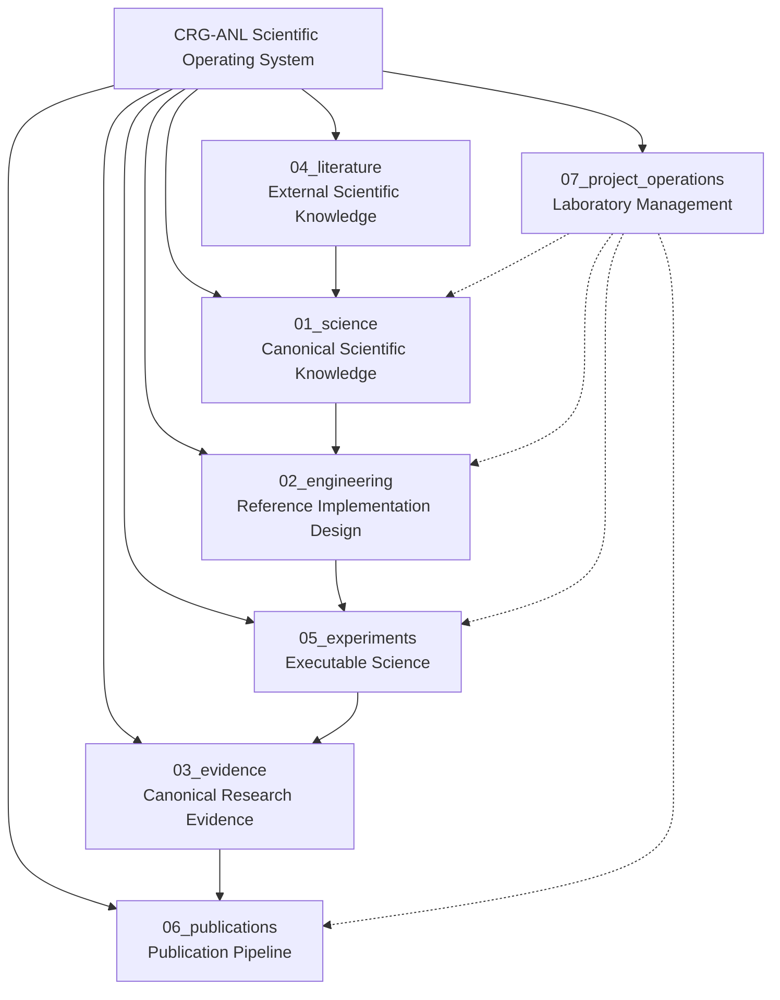
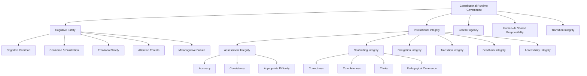

# CRG-ANL: Constitutional Runtime Governance for AI-Native Learning

**Contract ID:** CRGB-BC-001  
**Status:** ACTIVE — Phase 1 Data Collection Ready  
**Last Updated:** 2026-07-13

---

## What This Repository Is

This repository is a **scientific operating system** — a canonical research environment from which software, datasets, benchmarks, publications, and experiments originate. It is not a software project. It is not merely documentation. It is the laboratory within which the CRG-ANL Research Program operates.

The repository supports:

- **Reproducible longitudinal research** using researcher-as-subject methodology
- **Constitutional Runtime Governance** theory development and validation
- **Cognitive Safety** measurement and intervention design
- **Benchmark engineering** for AI-native educational systems
- **AI Safety research** at the intersection of learning science and governance

---

## Scientific Mission

> Develop and validate a rigorous, reproducible framework for evaluating how Constitutional Runtime Governance can protect and enhance **Cognitive Safety**, **Instructional Integrity**, **Learner Agency**, and **Human–AI Shared Responsibility** in AI-native educational environments, beginning with the Quantic MS in Artificial Intelligence Engineering as the inaugural longitudinal case study.

---

## Repository Architecture

The repository is organized into seven workstreams, each with a distinct scientific function:



| Workstream | Purpose | Status |
|------------|---------|--------|
| **01_science** | Canonical scientific knowledge — research program, constructs, taxonomy, glossary | Foundation complete |
| **02_engineering** | Reference implementation design — architecture, engine, instrumentation, schemas | Design complete |
| **03_evidence** | Canonical research evidence — observations, coded events, field notes, datasets | Awaiting Phase 1 data |
| **04_literature** | External scientific knowledge — papers, annotated bibliography, reading maps | Population in progress |
| **05_experiments** | Executable science — pilot protocols, analysis templates, colab notebooks | Pilot 001 protocol ready |
| **06_publications** | Publication pipeline — papers, figures, tables, supplementary materials | Awaiting evidence |
| **07_project_operations** | Laboratory management — decision log, change log, meeting notes, governance | Active |

---

## Start Research Now

### If you are beginning data collection TODAY

**→ Open [`QUICKSTART.md`](QUICKSTART.md) and follow it minute-by-minute.**

This is your operational entry point. It contains:
- Tonight's 10-minute setup
- Tomorrow's session timeline (pre-session → learning → post-session)
- Copy-paste templates for every artifact
- File naming conventions
- Git commit workflow
- Troubleshooting for common problems

### If you want to understand the research program first

1. Read `01_science/research_program.md` for mission, vision, themes, and scope
2. Read `01_science/student_experience_model.md` for the SX construct model
3. Read `01_science/construct_definitions.md` for the canonical construct ontology
4. Read `01_science/benchmark_taxonomy.md` for the evaluation hierarchy
5. Read `BUILD_CONTRACTS.md` for the full development roadmap

### If you want to contribute to the repository

1. Read `CONTRIBUTING.md` for contribution guidelines
2. Review `07_project_operations/decision_log.md` for established architectural decisions
3. All contributions must include production-quality documentation

---

## Core Constructs

The research program is built on a rigorously defined set of constructs:

| Construct | Definition | Status |
|-----------|-----------|--------|
| **Constitutional Runtime Governance** | A governance model in which principled behavioral constraints (a "constitution") are applied to AI systems dynamically during runtime, not merely as static pre-deployment filters or post-hoc audits | Canonical |
| **Cognitive Safety** | The protection of a learner's cognitive resources — attention, working memory, executive function, metacognitive capacity, and emotional equilibrium — from harm caused by AI-mediated instructional design | Canonical |
| **Instructional Integrity** | The property of an AI-native educational system whereby its instructional actions — content generation, scaffolding, assessment, feedback, navigation, and transitions — are accurate, coherent, consistent, and aligned with stated learning objectives | Canonical |
| **Learner Agency** | The capacity of a learner to set, pursue, and revise their own learning goals, strategies, and evaluative standards within an AI-native educational environment | Canonical |
| **Human–AI Shared Responsibility** | The negotiated distribution of cognitive, epistemic, and instructional labor between human learner and AI system, characterized by appropriate delegation, oversight, and mutual accountability | Canonical |
| **Transition Integrity** | The preservation of cognitive continuity, epistemic orientation, and learner agency during transitions between instructional states — lessons, topics, difficulty levels, modalities, or human–AI responsibility distributions | Canonical |
| **Runtime Intervention** | An action triggered in real time by the detection of a governance violation, cognitive safety risk, or instructional integrity failure, designed to restore safe and effective learning conditions | Canonical |
| **Learner Cockpit** | A persistent, learner-visible interface element that displays real-time information about the AI system's state, confidence, limitations, and governance status, enabling informed oversight and agency | Canonical |
| **Persistent Runtime Governance Window** | The continuous temporal scope within which Constitutional Runtime Governance operates — from the initiation of a learning session through all instructional transitions to session conclusion — ensuring no ungoverned instructional interval | Canonical |
| **Governance Benchmark** | A reproducible, standardized measurement instrument designed to evaluate the extent to which an AI-native educational system adheres to Constitutional Runtime Governance principles across defined dimensions | Canonical |
| **Researcher-as-Subject** | A methodological framework in which the researcher systematically studies their own learning experience within an AI-native educational environment, using structured observation, validated instruments, and rigorous analytical protocols | Canonical |

Full construct definitions with theoretical motivation, relationships, example observations, and future benchmark dimensions are available in `01_science/construct_definitions.md`.

---

## Benchmark Taxonomy

The evaluation hierarchy is organized as follows:



The full taxonomy with operational definitions, measurement approaches, and severity classifications is available in `01_science/benchmark_taxonomy.md`.

---

## Pilot Study Status

| Pilot | Title | Status | Target Start |
|-------|-------|--------|-------------|
| **Pilot 001** | Quantic Longitudinal Researcher-as-Subject Pilot | Protocol ready — awaiting first session | Next Quantic course |
| **Pilot 002** | [Reserved for cross-platform validation] | Planned | TBD |

See `05_experiments/pilot_001/` for the complete protocol.

---

## Artifact Status

Artifacts in this repository are labeled with their maturity status:

| Status | Meaning | Example |
|--------|---------|---------|
| **Draft vX.Y** | Complete as a draft; content is structurally sound but subject to refinement through pilot evidence | Most v0.1.0 artifacts at launch |
| **Under Review** | Undergoing peer or self-review; may change significantly | Post-pilot construct revisions |
| **Stable vX.Y** | Mature; changes require formal decision record | Post-validation benchmark taxonomy |
| **Superseded** | Replaced by a newer version; retained for traceability | Old schema versions |

All Draft artifacts include an explicit **Known Limitations** section documenting what is provisional, what evidence is needed to mature the artifact, and what changes are anticipated.

## Engineering Standards

All artifacts in this repository conform to the following standards:

| Standard | Application |
|----------|-------------|
| **Markdown** | All documentation, notes, and reports |
| **YAML** | All schemas, configuration, and machine-readable metadata |
| **Mermaid** | All diagrams and visual representations |
| **Git** | Version-controlled science with meaningful commit messages |
| **Semantic line breaks** | One sentence per line in Markdown for clean diffs |

Every directory contains a `README.md` describing: **purpose**, **relationships**, **inputs**, **outputs**, and **ownership**.

---

## Citation

If referencing this research program or its artifacts:

```bibtex
@software{crg_anl_2026,
  title = {CRG-ANL: Constitutional Runtime Governance for AI-Native Learning},
  subtitle = {Scientific Operating System},
  author = {{CRG-ANL Research Program}},
  year = {2026},
  url = {https://github.com/YOUR_ORG/crg-anl},
  note = {Contract CRGB-BC-001}
}
```

---

## License

This research program is released under the **MIT License** to maximize accessibility and encourage adoption by the research community. See `LICENSE` for details. Research data and publications may be subject to separate licensing terms specified in their respective directories.

---

*The Quantic curriculum is the experimental environment. The true object of study is a new generation of AI-native educational systems and how they can be systematically evaluated, governed, and improved for learners with diverse cognitive profiles.*
